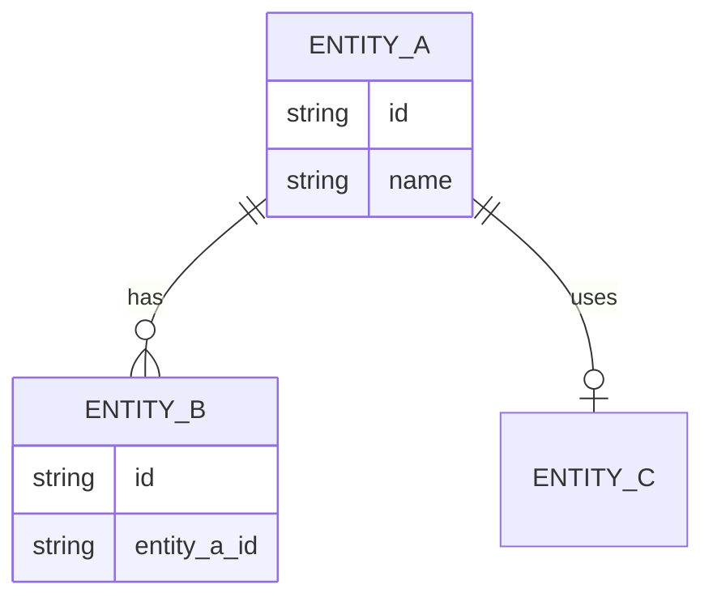

# ER図

このER図は、[対象システム] の主要なドメイン関係を表す。

```mermaid
erDiagram
    ENTITY_A ||--o{ ENTITY_B : has
    ENTITY_A ||--o| ENTITY_C : uses

    ENTITY_A {
        string id
        string name
    }

    ENTITY_B {
        string id
        string entity_a_id
    }
```

## 補足

- [SDK由来の型、概念モデルとしての補足、属性の省略方針]
