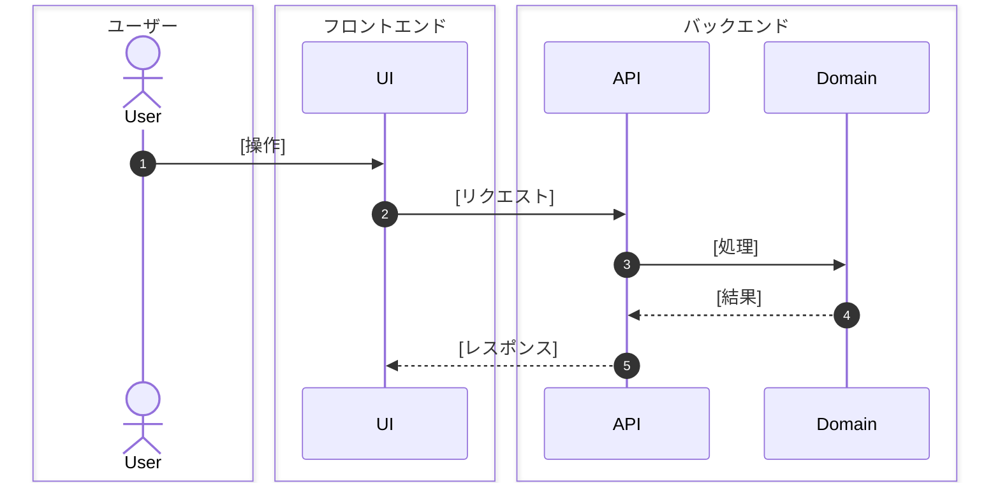
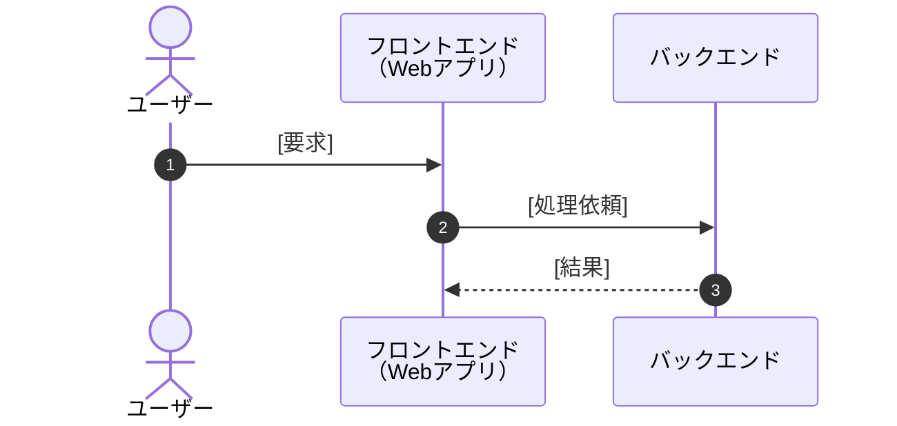

# シーケンス図

## システムレベル

```mermaid
sequenceDiagram
    autonumber
    box ユーザー
        actor User
    end
    box フロントエンド
        participant UI
    end
    box バックエンド
        participant API
        participant Domain
    end

    User->>UI: [操作]
    UI->>API: [リクエスト]
    API->>Domain: [処理]
    Domain-->>API: [結果]
    API-->>UI: [レスポンス]
```

## 抽象化した流れ

```mermaid
sequenceDiagram
    autonumber
    actor User as ユーザー
    participant UI as フロントエンド<br>（Webアプリ）
    participant Service as バックエンド

    User->>UI: [要求]
    UI->>Service: [処理依頼]
    Service-->>UI: [結果]
```
