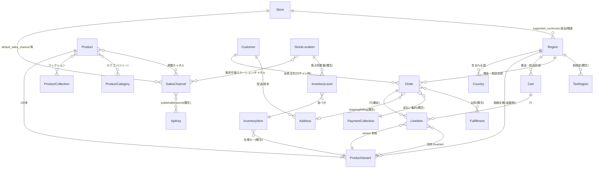

# ER 図

本 ER 図は、a-sandbox-ec のバックエンドが利用する **Medusa v2 コアコマースモジュール**上の、主要なエンティティ関係を**概念レベル**で表したものである。実体のテーブル名・中間テーブルは Medusa のマイグレーション定義に従い、**リンク（module links）** や **Query** 経路で結ばれる。本リポジトリの `initial-data-seed` が投入するオブジェクト（店舗・販売チャネル・リージョン・商品・在庫・カート/注文の前提）と整合するように、カーディナリティは代表値で記載している。

## 図

## 本サンドボックスで確認できる接続

- シード `apps/backend/src/migration-scripts/initial-data-seed.ts` は、`createSalesChannelsWorkflow` → 店舗 `createStoresWorkflow`、リージョン `createRegionsWorkflow`、商品 `createProductsWorkflow`、在庫 `createInventoryLevelsWorkflow` 等を順に実行し、上記エンティティの**一貫したデモ用リンク**を作る。
- ストアフロントの `getOrSetCart` は、**リージョン ID** 付きで `sdk.store.cart.create` を行うため、図中の `Region` と `Cart` の関係が実リクエスト上も明示される。

## 注意（SDK / 生成型との関係）

- TypeScript 上の `HttpTypes.StoreCart` や `StoreOrder` 等は `@medusajs/types` 由来であり、図のエンティティ名は API レスポンスの入れ子構造に対応する。物理カラムは PostgreSQL 上の Medusa 定義に従い、図の属性は**省略**している。
- 中間的な多対多（商品とチャネル、在庫と販路など）は、実装ではリンクテーブルやモジュール解決に分解される。詳細は [Medusa ドメインモデル / リソース](https://docs.medusajs.com) を参照のこと。
