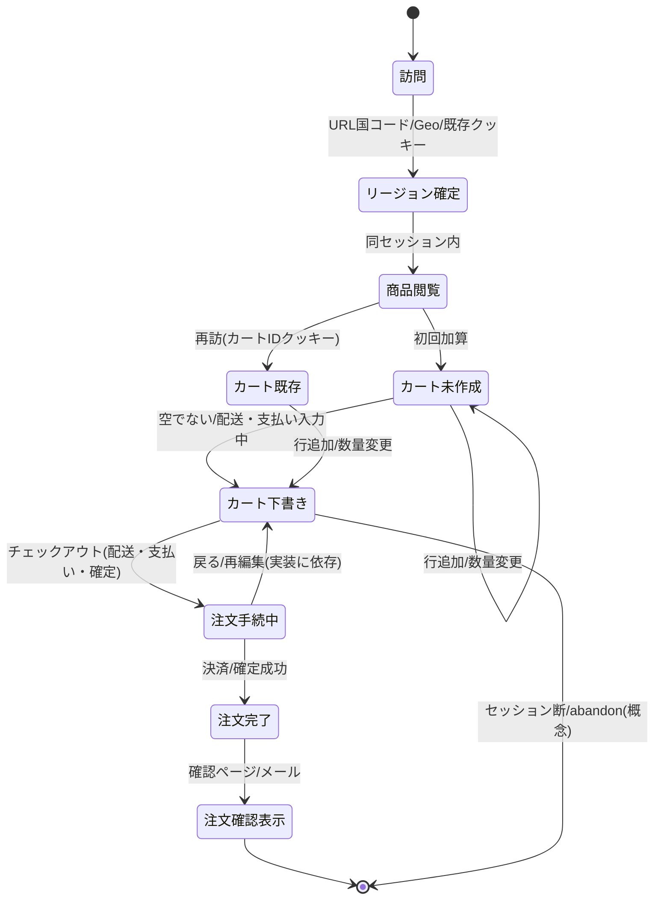
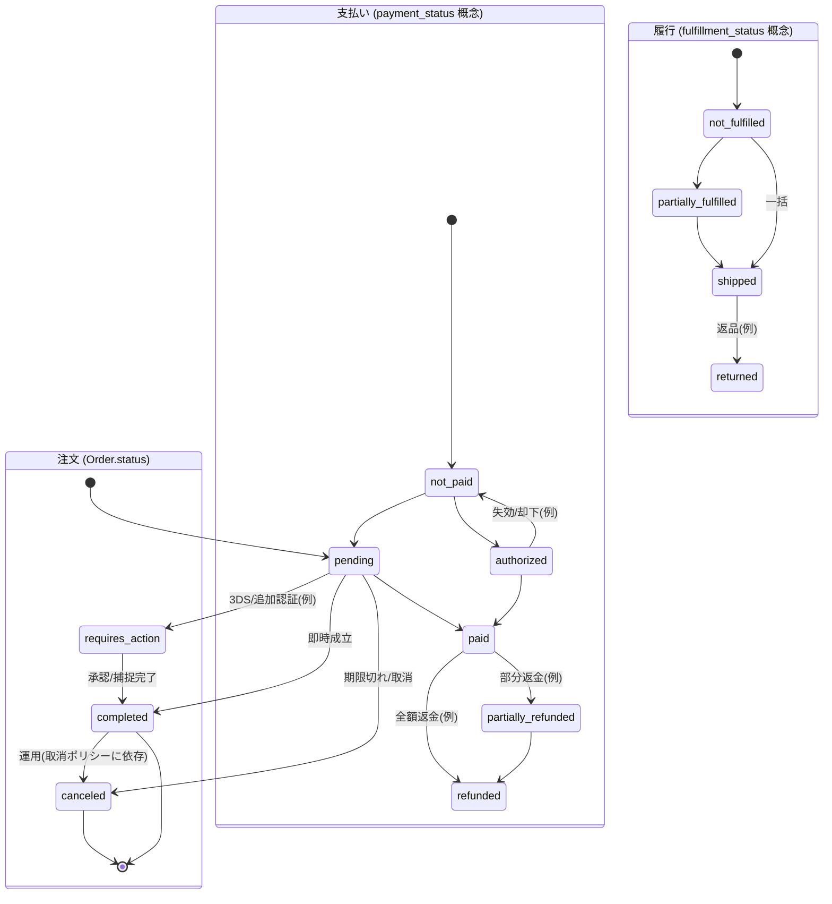

# 状態遷移図

本ドキュメントの状態遷移は、**a-sandbox-ec**（Medusa v2 バックエンド + Next.js ストアフロント）における、利用者の主要シナリオと、バックエンド上の**注文・決済**の代表状態を Mermaid で表したものである。DB の実際の列挙子は Medusa バージョンで微差があり得るため、**概念的な遷移**として読む。

## 1. ストアフロント上の主要ユースケース（カート〜注文確認）

訪問からカート保持、注文確定、確認表示までの流れを、アプリケーション上の**ユースケース段階**として示す。実装の詳細（API の内部状態名）は図2・Medusa ドキュメントと対応づけられる。

## 2. 注文・決済の代表的遷移（Medusa コア概念）

本サンドボックスの永続化は Medusa である。`Order` の **status**、**payment_status**、**fulfillment_status** はワークフロー（支払い取得・出荷等）に応じて遷移する。以下は**代表例**であり、全パターン（返品・要対応等）は公式ドメインモデルを参照のこと。

図1の「**注文完了**」に相当するタイミングで、図2の `Order`・支払い・履行の各軸が整合する（具体的な遷移順は決済・配送プロバイダ設定に依存する）。

## 補足

- カート（`Cart`）と注文（`Order`）の関係: 注文確定時にカート内容が**注文行**に写し替えられ、以降は `Order` を主とする。カートの寿命とクッキー管理は `apps/storefront/src/lib/data/cart.ts` およびクッキー系モジュールで行う。
- Admin 上での手動作業（ドラフト注文、一部フルフィルメント等）は、上記以外の遷移を生む。本図は**ストアフロント中心の既定フロー**の俯瞰用である。
