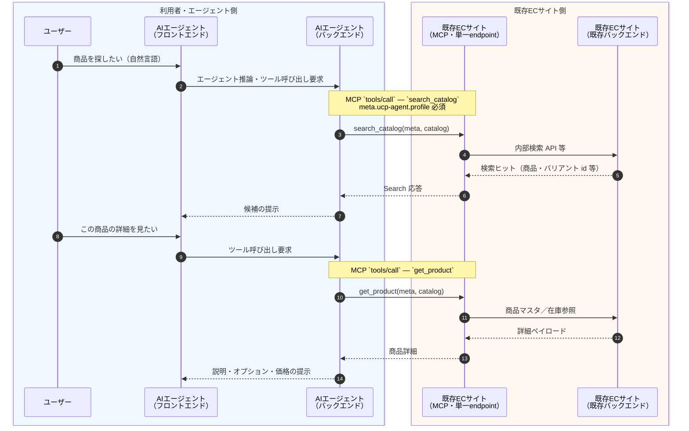
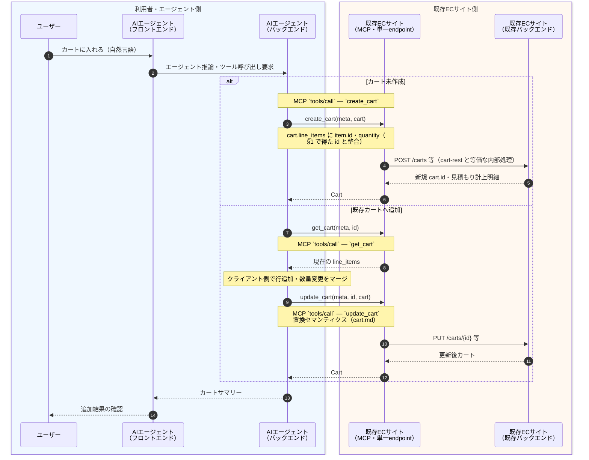
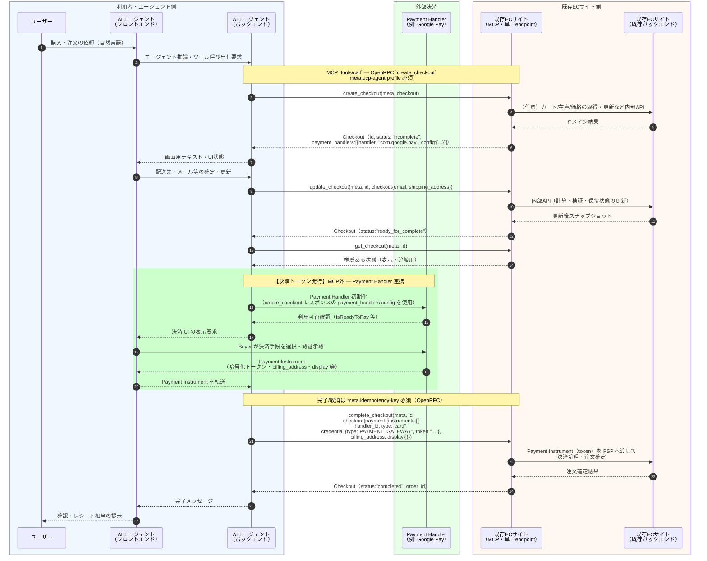

# UCP 接続シーケンス（設計素案）

[atakedemo/agent-commerce-research の Issue #9 — UCP接続の設計書作成](https://github.com/atakedemo/agent-commerce-research/issues/9#issue-4330162750) の「シーケンス図の作成」に沿った、**アクター間の処理の受け渡し**と **UCP Shopping で定義されている MCP ツール**（[商品検索・詳細](#1-具体シーケンス商品検索詳細閲覧mcp-前提)、[カート追加](#2-具体シーケンスカート追加mcp-前提)、[チェックアウト](#3-具体シーケンスチェックアウト完了まで)）の利用関係を整理する。

- **規格の一次情報**: [Universal-Commerce-Protocol/ucp](https://github.com/Universal-Commerce-Protocol/ucp) の `[source/services/shopping/mcp.openrpc.json](https://github.com/Universal-Commerce-Protocol/ucp/blob/main/source/services/shopping/mcp.openrpc.json)`（本リポジトリでは [references/ucp-shopping-mcp.openrpc.json](../references/ucp-shopping-mcp.openrpc.json) にミラー）。
- **本デモの MCP 実装**: `[b-mcp-server/](../b-mcp-server/)` — 上記 OpenRPC のチェックアウト系メソッド名に合わせた Tool（`create_checkout` / `get_checkout` / `update_checkout` / `complete_checkout` / `cancel_checkout`）を [Model Context Protocol](https://modelcontextprotocol.io/)（stdio）で公開。人向けのツール説明は `[mcp-reference.md](mcp-reference.md)` を参照（カタログ・カート Tool は規格 OpenRPC 上に定義があるが、本デモサーバーでは未実装の場合がある）。
- **仕様リンク（カタログ・カート）**: [Catalog（概要）](../../../references/specification/community/ucp/docs/specification/catalog/index.md)、[Catalog — MCP 束縛](../../../references/specification/community/ucp/docs/specification/catalog/mcp.md)、[Cart](../../../references/specification/community/ucp/docs/specification/cart.md)、[Cart — REST](../../../references/specification/community/ucp/docs/specification/cart-rest.md)、[Cart — MCP](../../../references/specification/community/ucp/docs/specification/cart-mcp.md)。
- **本書の前提（MCP 接続）**: マーチャントあたり **MCP の接続先は 1 点**。`/.well-known/ucp` の `services["dev.ucp.shopping"]` で `transport: "mcp"` とともに宣言される **単一の `endpoint`** に対し、エージェントは **同一 MCP セッション上の `tools/call`** でカタログ・カート・チェックアウトの各 Tool を呼び分ける（論理能力の違いであり、カタログ用・カート用など **複数 MCP URL を立てる前提ではない**）。

---

## 1. 具体シーケンス（商品検索・詳細閲覧、MCP 前提）

アクターは Issue 指定どおり: **ユーザー**、**AIエージェントアプリ（フロントエンド）**、**AIエージェントアプリ（バックエンド）**、**既存ECサイト（MCP・単一endpoint）**、**既存ECサイト（既存バックエンド）**。以降の §1〜§3 で登場する MCP は **いずれも同一 endpoint**（冒頭の前提どおり）。

仕様の論理能力・MCP Tool 名は [Catalog（概要）](../../../references/specification/community/ucp/docs/specification/catalog/index.md)、[Catalog — MCP](../../../references/specification/community/ucp/docs/specification/catalog/mcp.md) を参照。



**補足（別経路）**: 複数の商品・バリアント id をまとめて解決するときは `lookup_catalog` を用いてもよい（同一 MCP・同一 `tools/call` の別 Tool 名）。検索・詳細のレスポンスはセッション非保証で再利用時は再取得を推奨する旨は [catalog/index.md — Relationship to Checkout](../../../references/specification/community/ucp/docs/specification/catalog/index.md#relationship-to-checkout) に準ずる。

カートに載せる準備が整ったら [§2](#2-具体シーケンスカート追加mcp-前提) へ進む。各 Tool の **入出力・例** は [`mcp-reference.md`](mcp-reference.md) **§3〜§5** を参照。

---

## 2. 具体シーケンス（カート追加、MCP 前提）

アクターは §1 と同じ。カート系 Tool は **§1 の続きとして同一 MCP 接続**で呼ぶ。仕様は [cart.md](../../../references/specification/community/ucp/docs/specification/cart.md)、REST 束縛 [cart-rest.md](../../../references/specification/community/ucp/docs/specification/cart-rest.md)、MCP 束縛 [cart-mcp.md](../../../references/specification/community/ucp/docs/specification/cart-mcp.md)。



**補足（更新の意味）**: `update_cart` はカートリソースの **全置換**（[Update Cart](../../../references/specification/community/ucp/docs/specification/cart.md#update-cart)）。既存行を失わないよう、**必ず** `get_cart` の結果にマージした **全体**を `cart` に渡す。

購入意思が確定したら [§3](#3-具体シーケンスチェックアウト完了まで) のとおり `create_checkout` に **`cart_id` を渡してカートからチェックアウトへ引き継ぐ**（カート機能がプロファイルで交渉されている場合。手引きは [cart.md — Cart-to-Checkout Conversion](../../../references/specification/community/ucp/docs/specification/cart.md#cart-to-checkout-conversion)）。カート系 Tool の **入出力・例** は [`mcp-reference.md`](mcp-reference.md) **§6〜§8** を参照。

---

## 3. 具体シーケンス（チェックアウト完了まで）

アクターは Issue 指定どおり: **ユーザー**、**AIエージェントアプリ（フロントエンド）**、**AIエージェントアプリ（バックエンド）**、**既存ECサイト（MCP・§1・§2 と同一 endpoint）**、**既存ECサイト（既存バックエンド）**。チェックアウト系 Tool も **§1・§2 と同じ MCP 接続**で呼ぶ（別プロセス・別 URL の MCP は前提としない）。

**決済トークン発行について**: UCP の Payment Handler（`com.google.pay` 等）との連携は **MCP の外**で行う。`create_checkout` のレスポンスに含まれる `payment_handlers` config を使い、Platform が Payment Handler を直接呼び出してトークン（`PaymentInstrument`）を取得する。取得したトークンを `complete_checkout` の `payment.instruments` に渡すことで決済が完結する（[payment-handler-guide.md](../../../references/specification/community/ucp/docs/specification/payment-handler-guide.md)、[tokenization-guide.md](../../../references/specification/community/ucp/docs/specification/tokenization-guide.md)）。



**取消フロー（任意経路）**: `complete_checkout` の代わりに `cancel_checkout(meta, id)` が呼ばれ、MCP サーバーが既存バックエンド上の保留取引を安全に破棄する想定。決済トークン発行後にキャンセルする場合は、Payment Handler 側のトークン失効とあわせて処理する。

---

### 補足：決済トークン発行の詳細（`create_checkout` レスポンスからの情報取得と API 呼び出し）

#### 1. `create_checkout` レスポンスの参照パス

Platform は `create_checkout` レスポンスの下記 JSON パスから Payment Handler の設定情報を取得する。

```json
{
  "id": "co_3f7c8e2a-...",
  "status": "incomplete",
  "checkout": {
    "totals": [
      { "type": "total", "amount": 5500, "currency": "JPY" }
    ],
    "payment_handlers": {
      "com.google.pay": [
        {
          "id": "gpay_handler_001",
          "version": "2026-01-23",
          "available_instruments": [
            { "type": "card", "constraints": { "brands": ["visa", "mastercard", "amex"] } }
          ],
          "config": {
            "api_version": 2,
            "environment": "PRODUCTION",
            "merchant_info": {
              "merchant_name": "My EC Store",
              "merchant_id": "12345678901234567890",
              "merchant_origin": "https://merchant.example.com"
            },
            "allowed_payment_methods": [
              {
                "type": "CARD",
                "parameters": {
                  "allowed_auth_methods": ["PAN_ONLY"],
                  "allowed_card_networks": ["VISA", "MASTERCARD", "AMEX"],
                  "billingAddressRequired": true,
                  "billingAddressParameters": { "format": "FULL" }
                },
                "tokenization_specification": {
                  "type": "PAYMENT_GATEWAY",
                  "parameters": {
                    "gateway": "example_psp",
                    "gatewayMerchantId": "merchant_001"
                  }
                }
              }
            ]
          }
        }
      ]
    }
  }
}
```

| 参照パス | 用途 |
| :--- | :--- |
| `checkout.payment_handlers["com.google.pay"][0].id` | `complete_checkout` の `handler_id` に使う |
| `checkout.payment_handlers["com.google.pay"][0].config.api_version` | Google Pay API の初期化パラメータ |
| `checkout.payment_handlers["com.google.pay"][0].config.environment` | `"TEST"` or `"PRODUCTION"` の切り替え |
| `checkout.payment_handlers["com.google.pay"][0].config.merchant_info` | `PaymentsClient` 初期化 / `loadPaymentData` の `merchantInfo` |
| `checkout.payment_handlers["com.google.pay"][0].config.allowed_payment_methods` | `isReadyToPay` / `loadPaymentData` の `allowedPaymentMethods` |
| `checkout.payment_handlers["com.google.pay"][0].config.allowed_payment_methods[].tokenization_specification` | PSP 向けトークン化仕様（`gateway`・`gatewayMerchantId`） |
| `checkout.totals[]` (`type: "total"`) | `loadPaymentData` の `transactionInfo.totalPrice` と `currencyCode` |
| `checkout.payment_handlers["com.google.pay"][0].available_instruments[].constraints.brands` | 表示するカードブランドの絞り込み（Business が解決した権威値） |

#### 2. Platform 側の API 呼び出し手順（例: Google Pay）

```
① PaymentsClient の初期化
   new google.payments.api.PaymentsClient({
     environment: config.environment           // ← checkout.payment_handlers["com.google.pay"][0].config.environment
   })

② isReadyToPay — 利用可否の確認
   paymentsClient.isReadyToPay({
     apiVersion:      config.api_version,      // ← .config.api_version
     apiVersionMinor: 0,
     allowedPaymentMethods: config.allowed_payment_methods  // ← .config.allowed_payment_methods
   })
   → { result: true } なら決済ボタンを表示

③ loadPaymentData — Buyer の認証と Payment Instrument の取得
   paymentsClient.loadPaymentData({
     apiVersion:      config.api_version,
     apiVersionMinor: 0,
     merchantInfo:    config.merchant_info,    // ← .config.merchant_info（merchant_name / merchant_id / merchant_origin）
     allowedPaymentMethods: config.allowed_payment_methods,
     transactionInfo: {
       totalPriceStatus: "FINAL",
       totalPrice: String(total.amount / 100), // ← checkout.totals[type="total"].amount（通貨最小単位→文字列）
       currencyCode: total.currency            // ← checkout.totals[type="total"].currency
     }
   })
   → PaymentData {
       paymentMethodData: {
         type: "CARD",
         tokenizationData: {
           type: "PAYMENT_GATEWAY",
           token: "{encrypted-token}"          // ← complete_checkout の credential.token に使う
         },
         info: {
           cardNetwork: "VISA",
           cardDetails: "4242"                 // ← display.brand / display.last_digits に使う
         },
         description: "Visa •••• 4242"
       },
       shippingAddress: { ... }                // ← billing_address に使う（設定に依存）
     }
```

#### 3. `complete_checkout` に渡す `PaymentInstrument` の組み立て

上記 `loadPaymentData` のレスポンスを UCP の `PaymentInstrument` 形式に変換して `complete_checkout` に渡す。

```json
{
  "id": "instr_001",
  "handler_id": "gpay_handler_001",
  "type": "card",
  "display": {
    "brand": "visa",
    "last_digits": "4242",
    "description": "Visa •••• 4242"
  },
  "billing_address": {
    "first_name": "Taro",
    "last_name": "Yamada",
    "street_address": "1-1-1 Shibuya",
    "address_locality": "Shibuya-ku",
    "address_region": "Tokyo",
    "postal_code": "150-0001",
    "address_country": "JP"
  },
  "credential": {
    "type": "PAYMENT_GATEWAY",
    "token": "{encrypted-token from tokenizationData.token}"
  }
}
```

| `PaymentInstrument` フィールド | 組み立て元 |
| :--- | :--- |
| `handler_id` | `checkout.payment_handlers["com.google.pay"][0].id` |
| `type` | Google Pay の `paymentMethodData.type`（`"CARD"` → UCP では `"card"`） |
| `display.brand` | `paymentMethodData.info.cardNetwork`（小文字化） |
| `display.last_digits` | `paymentMethodData.info.cardDetails` |
| `display.description` | `paymentMethodData.description` |
| `billing_address` | `loadPaymentData` の `billingAddress`（`billingAddressRequired: true` の場合） |
| `credential.type` | `paymentMethodData.tokenizationData.type`（`"PAYMENT_GATEWAY"`） |
| `credential.token` | `paymentMethodData.tokenizationData.token`（PSP の復号対象） |

---

カタログ・カート・チェックアウト各 Tool の **説明・入力・応答例**は [`mcp-reference.md`](mcp-reference.md) を参照（カタログ・カートは **§3〜§8**、チェックアウトは **§9 以降**）。

---

## 4. 抽象シーケンス（役割ベース）

実装名に依存しない読み替え用。


---

## 5. MCP ツールと規格の対応（カタログ・カート・チェックアウト）

各 Tool の **説明・`arguments`／応答の例**は [`mcp-reference.md`](mcp-reference.md) **§3〜§13**（カタログ・カート §3〜§8、チェックアウト §9〜§13）。

OpenRPC でのメソッド名は [ucp-shopping-mcp.openrpc.json](../references/ucp-shopping-mcp.openrpc.json) に **ひとまとまり**で載る。エージェントが解決するのはマーチャントの **`/.well-known/ucp`** における `services["dev.ucp.shopping"]` の **MCP transport 用 URL 1 つ**であり、下表のカタログ・カート・チェックアウトの各 Tool は **その同一 endpoint 上の `tools/call` の `name` 違い**として扱う（本デモの `b-mcp-server` はチェックアウト中心の参照実装で、カタログ／カート Tool は未実装の場合がある）。

### カタログ（MCP）


| MCP Tool         | UCP OpenRPC メソッド | 仕様（論理能力）                                                                                                                  | 備考                                                                                                                                   |
| ---------------- | ---------------- | ------------------------------------------------------------------------------------------------------------------------- | ------------------------------------------------------------------------------------------------------------------------------------ |
| `search_catalog` | `search_catalog` | `[dev.ucp.shopping.catalog.search](../../../references/specification/community/ucp/docs/specification/catalog/search.md)` | キーワード・フィルタ・ページネーション等。[Catalog MCP](../../../references/specification/community/ucp/docs/specification/catalog/mcp.md#search_catalog) |
| `lookup_catalog` | `lookup_catalog` | `[dev.ucp.shopping.catalog.lookup](../../../references/specification/community/ucp/docs/specification/catalog/lookup.md)` | 識別子のバッチ解決                                                                                                                            |
| `get_product`    | `get_product`    | 同上（詳細取得）                                                                                                                  | 商品詳細・オプション選択に利用。`[get_product](../../../references/specification/community/ucp/docs/specification/catalog/mcp.md#get_product)`       |


### カート（MCP）


| MCP Tool      | UCP OpenRPC メソッド | 仕様                                                                                                    | 備考                                                                                                                                                                                                                                                                     |
| ------------- | ---------------- | ----------------------------------------------------------------------------------------------------- | ---------------------------------------------------------------------------------------------------------------------------------------------------------------------------------------------------------------------------------------------------------------------- |
| `create_cart` | `create_cart`    | [Create Cart](../../../references/specification/community/ucp/docs/specification/cart.md#create-cart) | `cart.line_items` で初回から明細を載せられる。[MCP 例](../../../references/specification/community/ucp/docs/specification/cart-mcp.md#create_cart)。HTTP 束縛は [cart-rest.md — POST /carts](../../../references/specification/community/ucp/docs/specification/cart-rest.md#create-cart) |
| `get_cart`    | `get_cart`       | [Get Cart](../../../references/specification/community/ucp/docs/specification/cart.md#get-cart)       | 既存カートのスナップショット。追加前のマージ元                                                                                                                                                                                                                                                |
| `update_cart` | `update_cart`    | [Update Cart](../../../references/specification/community/ucp/docs/specification/cart.md#update-cart) | **全置換**。行追加は `get_cart` → マージ → `update_cart`                                                                                                                                                                                                                          |
| `cancel_cart` | `cancel_cart`    | [Cancel Cart](../../../references/specification/community/ucp/docs/specification/cart.md#cancel-cart) | セッション破棄                                                                                                                                                                                                                                                                |


### チェックアウト（MCP）


| MCP Tool（本デモ `b-mcp-server`） | UCP OpenRPC メソッド    | 備考                                                                                                                                                                           |
| ---------------------------- | ------------------- | ---------------------------------------------------------------------------------------------------------------------------------------------------------------------------- |
| `create_checkout`            | `create_checkout`   | `meta` 必須、`ucp-agent.profile` 必須。カート利用時は `cart_id` で引き継ぎ可（[cart.md](../../../references/specification/community/ucp/docs/specification/cart.md#cart-to-checkout-conversion)）。レスポンスに `payment_handlers` config が含まれる |
| `get_checkout`               | `get_checkout`      | `id` はチェックアウト識別子                                                                                                                                                             |
| `update_checkout`            | `update_checkout`   | 差分更新セマンティクスは規格側スキーマに準拠して拡張                                                                                                                                                   |
| —（MCP外）                    | —                   | **【決済トークン発行】** `create_checkout` レスポンスの `payment_handlers` config を用い、Platform が Payment Handler（例: `com.google.pay`）を直接呼び出してトークンを取得する。MCP Tool ではなく Platform 側の処理（§3 シーケンス参照） |
| `complete_checkout`          | `complete_checkout` | `meta.idempotency-key` 必須。`checkout.payment.instruments` に決済トークン発行で得た `PaymentInstrument`（handler_id・type・credential・billing_address 等）を含めて送信する                              |
| `cancel_checkout`            | `cancel_checkout`   | `meta.idempotency-key` 必須                                                                                                                                                    |


---

## 6. MCP サーバーの起動（開発用）

手順の詳細は **[`mcp-reference.md`](mcp-reference.md) §14** を参照。概要のみ:

```bash
cd demos/01-sample-ucp_ap2/b-mcp-server
npm install
npm start
```

## 7. Assumptions

- **MCP はマーチャントあたり単一 endpoint** を前提とする。**§1〜§3** の具体シーケンスは同一 MCP サーバー（同一接続）上の Tool 列として読む。Tool の入出力・例は [`mcp-reference.md`](mcp-reference.md) §3 以降。複数 MCP エンドポイントへ意図的に分割する構成は本書のスコープ外。
- **認証・署名**（`meta.signature`、HTTP における `UCP-Agent` 相当）の厳密な検証は本デモでは未実装。規格上の必須/推奨は [UCP 仕様リポジトリ](https://github.com/Universal-Commerce-Protocol/ucp) 側の最新版に従う。
- **既存バックエンド**が Medusa の場合、UCP の `Checkout` JSON と Store API のカート/注文は **1:1 ではない**。本図は「MCP 層がアダプタとなり内部 API を呼ぶ」という責務分割のみ示し、フィールドマッピングは別タスクとする。

