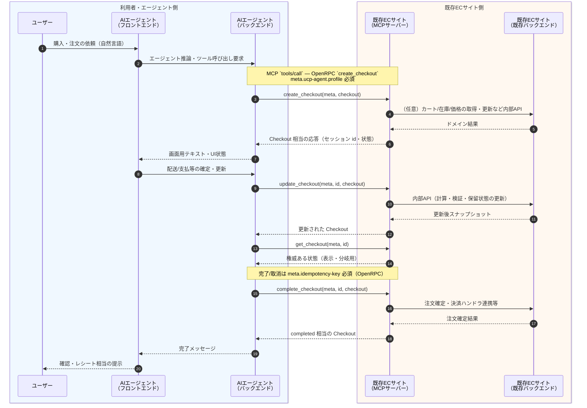
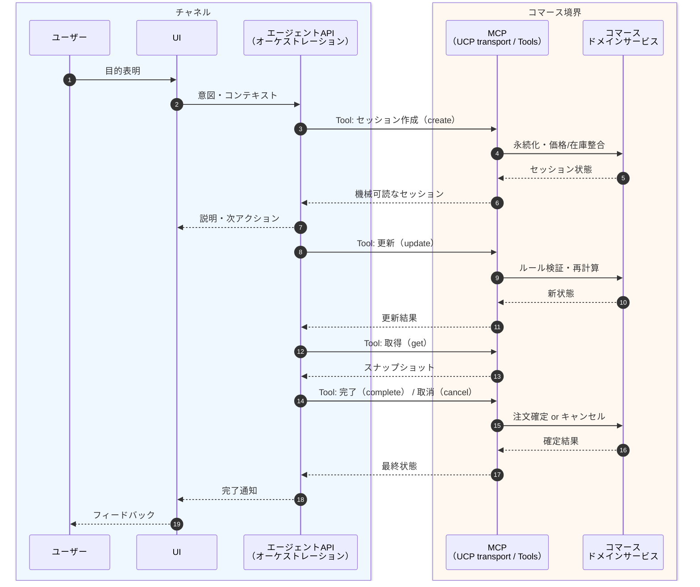

# UCP 接続シーケンス（設計素案）

[atakedemo/agent-commerce-research の Issue #9 — UCP接続の設計書作成](https://github.com/atakedemo/agent-commerce-research/issues/9#issue-4330162750) の「シーケンス図の作成」に沿った、**アクター間の処理の受け渡し**と **UCP Shopping で定義されている MCP ツール（チェックアウト系）**の利用関係を整理する。

- **規格の一次情報**: [Universal-Commerce-Protocol/ucp](https://github.com/Universal-Commerce-Protocol/ucp) の [`source/services/shopping/mcp.openrpc.json`](https://github.com/Universal-Commerce-Protocol/ucp/blob/main/source/services/shopping/mcp.openrpc.json)（本リポジトリでは [references/ucp-shopping-mcp.openrpc.json](../references/ucp-shopping-mcp.openrpc.json) にミラー）。
- **本デモの MCP 実装**: [`b-mcp-server/`](../b-mcp-server/) — 上記 OpenRPC のチェックアウト系メソッド名に合わせた Tool（`create_checkout` / `get_checkout` / `update_checkout` / `complete_checkout` / `cancel_checkout`）を [Model Context Protocol](https://modelcontextprotocol.io/)（stdio）で公開。人向けのツール説明は [`mcp-reference.md`](mcp-reference.md) を参照。
- **補足**: OpenRPC にはカタログ・カート・注文取得などのメソッドも定義があるが、Issue 本文の粒度では「詳細化は後ほど」とあるため、本図は**チェックアウト・ライフサイクル**を主軸とする。カート／カタログは別途拡張可能。

---

## 1. 具体シーケンス（チェックアウト完了まで）

アクターは Issue 指定どおり: **ユーザー**、**AIエージェントアプリ（フロントエンド）**、**AIエージェントアプリ（バックエンド）**、**既存ECサイト（MCPサーバー）**、**既存ECサイト（既存バックエンド）**。



**取消フロー（任意経路）**: `complete_checkout` の代わりに `cancel_checkout(meta, id)` が呼ばれ、MCP サーバーが既存バックエンド上の保留取引を安全に破棄する想定。

---

## 2. 抽象シーケンス（役割ベース）

実装名に依存しない読み替え用。



---

## 3. MCP ツールと規格の対応（チェックアウト）

| MCP Tool（本デモ `b-mcp-server`） | UCP OpenRPC メソッド | 備考 |
|--------------------------------------|----------------------|------|
| `create_checkout` | `create_checkout` | `meta` 必須、`ucp-agent.profile` 必須 |
| `get_checkout` | `get_checkout` | `id` はチェックアウト識別子 |
| `update_checkout` | `update_checkout` | 差分更新セマンティクスは規格側スキーマに準拠して拡張 |
| `complete_checkout` | `complete_checkout` | `meta.idempotency-key` 必須 |
| `cancel_checkout` | `cancel_checkout` | `meta.idempotency-key` 必須 |

エンドポイント URL は OpenRPC の `info` にあるとおり、マーチャントの **`/.well-known/ucp`** で宣言された `services["dev.ucp.shopping"]` の MCP transport から解決する（本デモの stdio サーバーは開発用の参照実装）。

---

## 4. MCP サーバーの起動（開発用）

手順の詳細は **[`mcp-reference.md`](mcp-reference.md) §8** を参照。概要のみ:

```bash
cd demos/01-sample-ucp_ap2/b-mcp-server
npm install
npm start
```

## 5. Assumptions

- **認証・署名**（`meta.signature`、HTTP における `UCP-Agent` 相当）の厳密な検証は本デモでは未実装。規格上の必須/推奨は [UCP 仕様リポジトリ](https://github.com/Universal-Commerce-Protocol/ucp) 側の最新版に従う。
- **既存バックエンド**が Medusa の場合、UCP の `Checkout` JSON と Store API のカート/注文は **1:1 ではない**。本図は「MCP 層がアダプタとなり内部 API を呼ぶ」という責務分割のみ示し、フィールドマッピングは別タスクとする。
