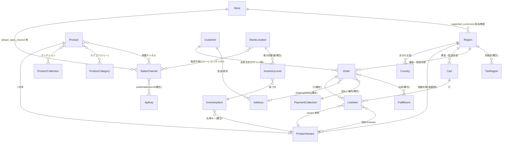
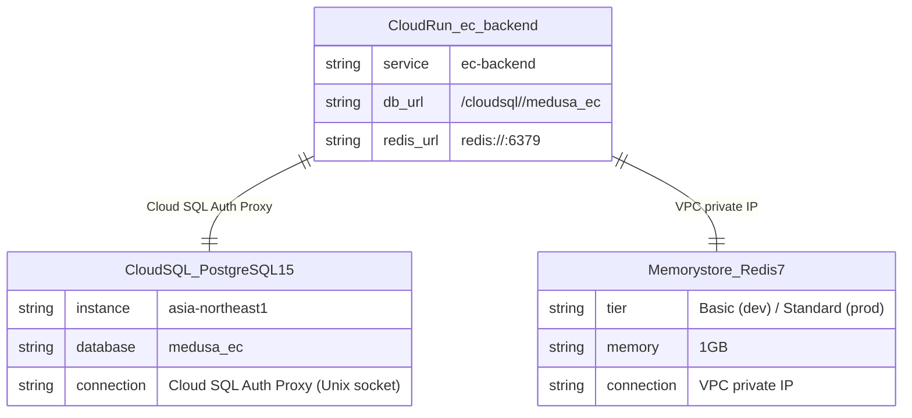

# ER 図（GCPデプロイ版）

本ER図は `demos/01-sample-ucp_ap2/zz-docs/er.md` をGCPデプロイ構成に対応させたものである。
データモデル自体はMedusa v2の定義に従い変更なし。GCPでは **Cloud SQL（PostgreSQL 15）** 上に永続化される。

## インフラ対応

| ローカル開発 | GCP |
|---|---|
| PostgreSQL（localhost:5432） | Cloud SQL（PostgreSQL 15 / `db-g1-small` or `db-custom-2-7680`） |
| Redis（localhost:6379） | Memorystore for Redis 7 |
| 接続方式 | Cloud SQL Auth Proxy（Cloud Run → Unix ソケット `/cloudsql/<instance>`） |

---

## ER図（Medusa v2 コアコマースモジュール）

`a-sandbox-ec` バックエンドが利用する Medusa v2 の主要エンティティ関係を**概念レベル**で示す。
物理テーブル・中間テーブルは Medusa のマイグレーション定義に従い、Cloud SQL 上に生成される。



---

## GCP構成でのデータフロー



---

## Cloud SQL 上の主要テーブル（Medusa v2 マイグレーション生成）

Medusa v2 の `npm run db:migrate`（`medusa db:migrate`）により、Cloud SQL インスタンスの `medusa_ec` データベースに以下のテーブル群が生成される。

| テーブル群 | 概要 |
|---|---|
| `store`, `store_currency` | ストア・通貨設定 |
| `sales_channel`, `publishable_api_key` | 販売チャネル・APIキー |
| `region`, `region_country`, `tax_region` | リージョン・国・税設定 |
| `product`, `product_variant`, `product_option` | 商品マスタ |
| `product_category`, `product_collection` | カテゴリ・コレクション |
| `cart`, `line_item`, `cart_shipping_method` | カート・行・配送 |
| `order`, `order_line_item`, `order_shipping_method` | 注文・行・配送 |
| `customer`, `customer_address` | 顧客・住所 |
| `payment_collection`, `payment_session` | 支払い集約・セッション |
| `inventory_item`, `inventory_level`, `stock_location` | 在庫・拠点 |
| `fulfillment`, `fulfillment_item` | 出荷 |

---

## Memorystore（Redis）の用途

| 用途 | キー例 | TTL |
|---|---|---|
| Medusa セッションキャッシュ | `sess:<session_id>` | 24h |
| カートセッション | `medusa_cart_<id>` | セッション期間 |
| ジョブキュー（Bull MQ） | `bull:<queue>:*` | ジョブ完了後 |

---

## GCPデプロイ時のDB初期化手順

```bash
# 1. Cloud Run Job でマイグレーション実行
gcloud run jobs execute ec-backend-migration \
  --region=asia-northeast1 \
  --wait

# 2. シードデータ投入（初回のみ）
gcloud run jobs execute ec-backend-seed \
  --region=asia-northeast1 \
  --wait
```

Medusa の `initial-data-seed.ts` が以下のワークフローを順に実行する：
`createSalesChannelsWorkflow` → `createStoresWorkflow` → `createRegionsWorkflow` → `createProductsWorkflow` → `createInventoryLevelsWorkflow`

---

## 注意

- TypeScript 上の `HttpTypes.StoreCart`・`StoreOrder` 等は `@medusajs/types` 由来であり、図のエンティティ名は API レスポンスの入れ子構造に対応する。物理カラムは Cloud SQL 上の Medusa マイグレーション定義に従う。
- 多対多（商品とチャネル、在庫と販路等）はリンクテーブルやモジュール解決に分解される。詳細は [Medusa ドキュメント](https://docs.medusajs.com) を参照。
- Cloud SQL の物理バックアップは日次で自動実行（保持7日）。Terraform の `google_sql_database_instance` リソースで設定。
