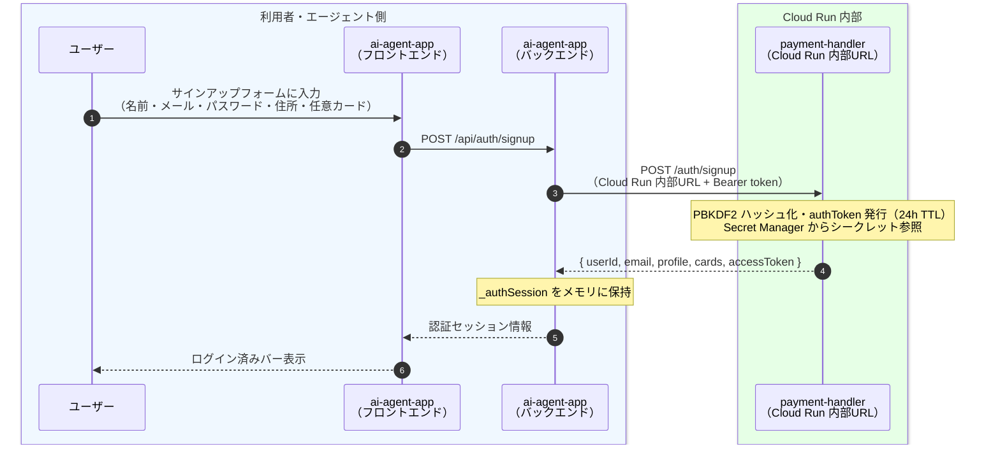
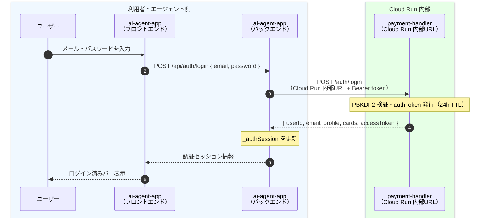
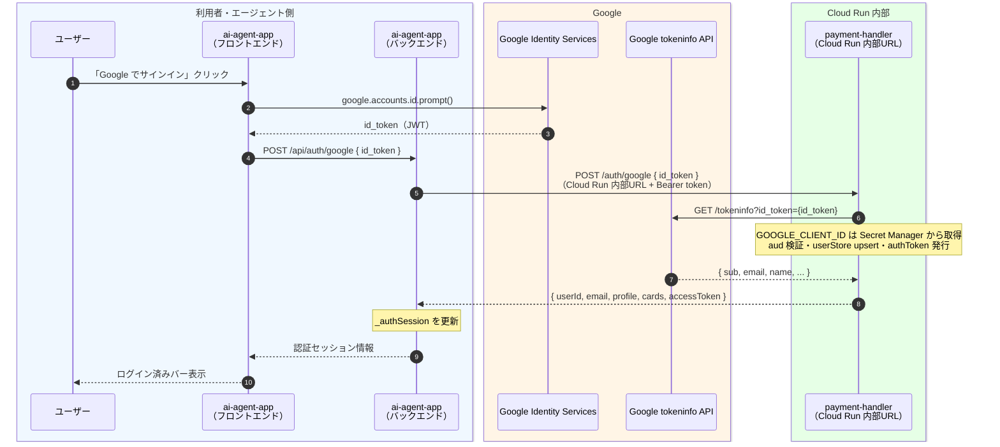
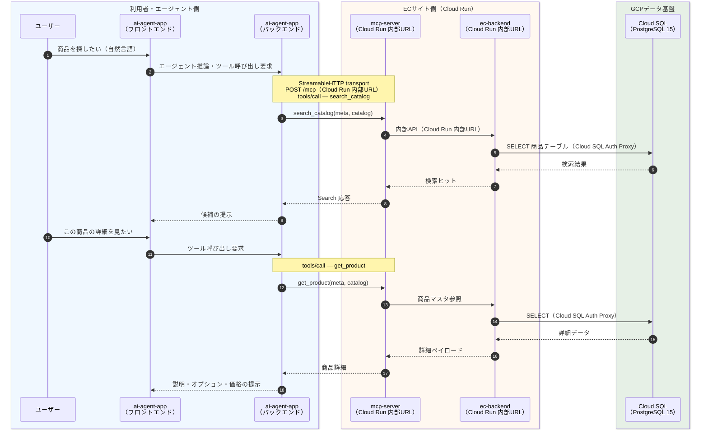
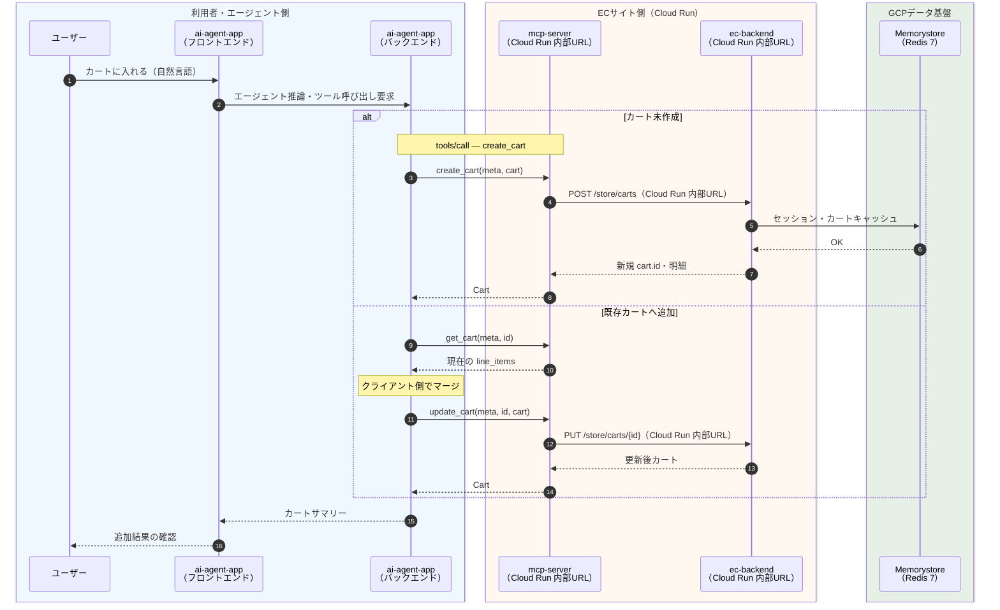
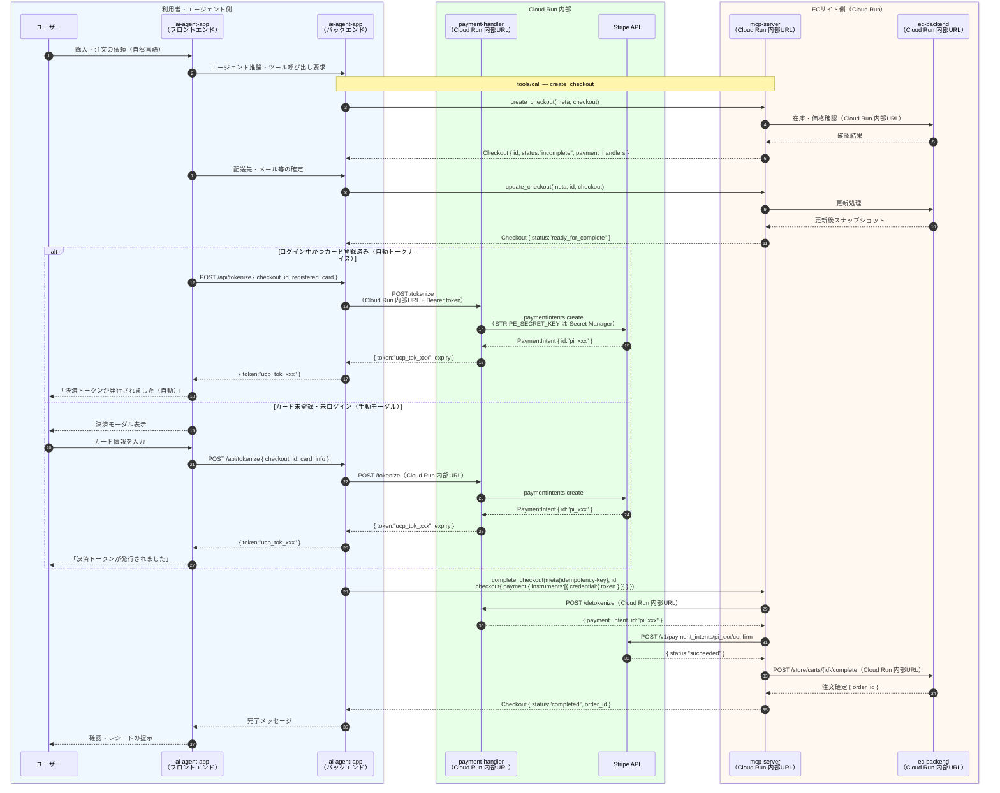
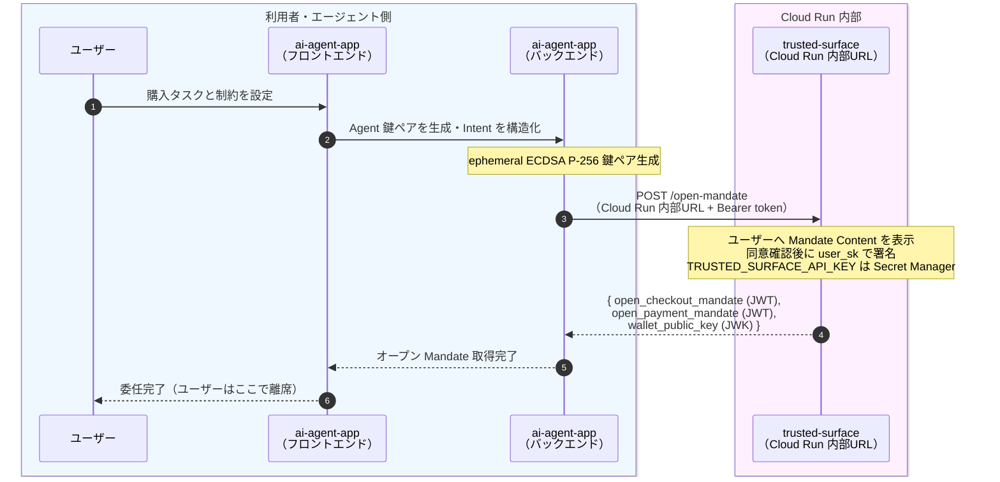
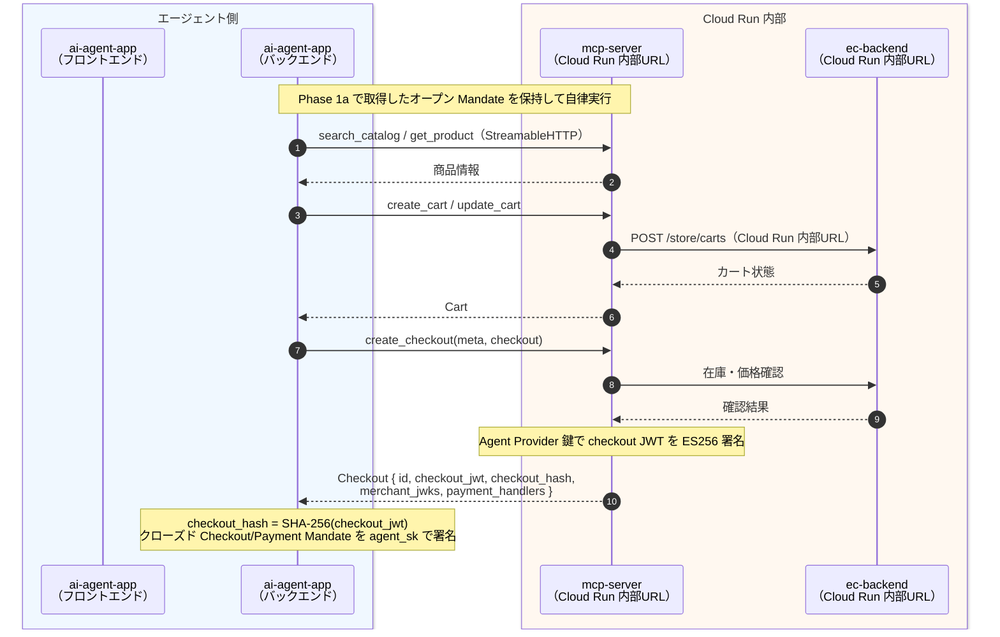
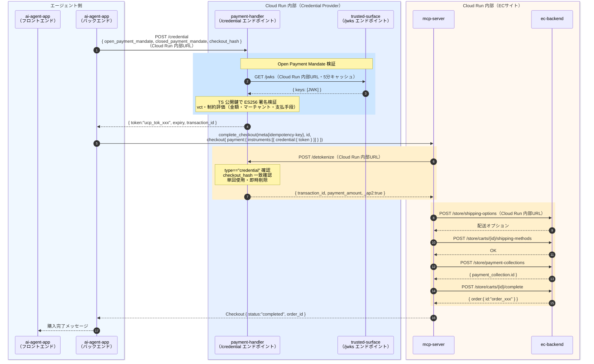
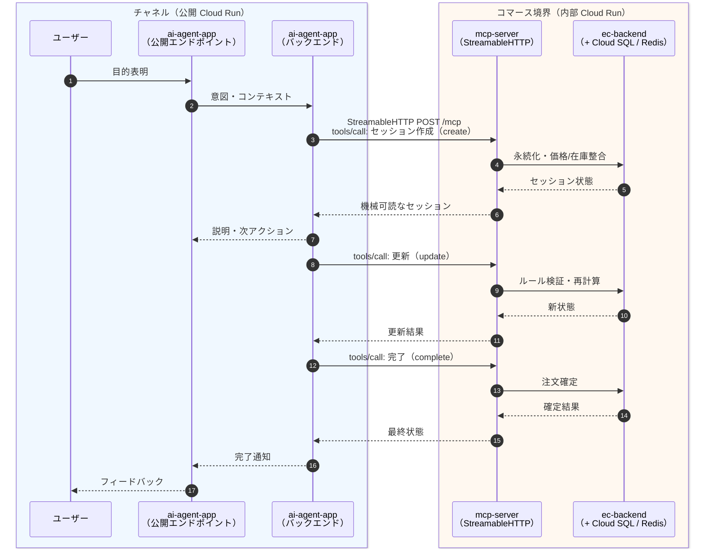

# UCP 接続シーケンス（GCPデプロイ版）

本書は `demos/01-sample-ucp_ap2/zz-docs/sequence.md` をGCPデプロイ構成に対応させたものである。
ローカル開発版との主な差分は以下の通り。

| 差分項目 | ローカル開発版 | GCPデプロイ版 |
|---|---|---|
| b-mcp-server 起動方式 | stdio（サブプロセス） | HTTP（Cloud Run + StreamableHTTP transport） |
| サービス間通信 | localhost ポート直接 | Cloud Run 内部URL（HTTPS） |
| MCP クライアント接続 | `StdioClientTransport` | `StreamableHTTPClientTransport` |
| DB 接続 | PostgreSQL（localhost） | Cloud SQL Auth Proxy（Unix ソケット） |
| シークレット | `.env` ファイル | Secret Manager（Cloud Run 環境変数マウント） |

---

## GCP サービス対応表

| ローカル名称 | GCP Cloud Run サービス名 | 内部エンドポイント |
|---|---|---|
| c-ai-agent-app（FE/BE） | `ai-agent-app` | `https://ai-agent-app-<hash>-an.a.run.app` |
| b-mcp-server | `mcp-server` | `https://mcp-server-<hash>-an.a.run.app` |
| d-payment_handler | `payment-handler` | `https://payment-handler-<hash>-an.a.run.app` |
| e-trusted_surface | `trusted-surface` | `https://trusted-surface-<hash>-an.a.run.app` |
| a-sandbox-ec（backend） | `ec-backend` | `https://ec-backend-<hash>-an.a.run.app` |
| a-sandbox-ec（storefront） | `ec-storefront` | `https://ec-storefront-<hash>-an.a.run.app`（公開） |

> 内部エンドポイントは Cloud Run の `--ingress internal-and-cloud-load-balancing` 設定により外部から直接アクセス不可。サービス間呼び出しはサービスアカウントの `run.invoker` ロールで認証。

---

## 0. ユーザー認証フロー（サインアップ・ログイン・Google SSO）

GCP版では `ai-agent-app`（Cloud Run）と `payment-handler`（Cloud Run 内部）間の通信となる。

### 0-1. サインアップ



### 0-2. ログイン



### 0-3. Google SSO



---

## 1. 商品検索・詳細閲覧（MCP over HTTP）

GCP版では `ai-agent-app` → `mcp-server`（Cloud Run 内部URL）へ StreamableHTTP transport で接続する。



---

## 2. カート追加（MCP over HTTP）



---

## 3. チェックアウト完了まで（UCP フロー）



---

## 4. AP2 HNP フロー（Human Not Present / 自律決済）

### Phase 1a — ユーザー在席時（Open Mandate の委任）



### Phase 1b — Human Not Present（自律ショッピング）



### Phase 2 — Human Not Present（自律決済）



---

## 5. 抽象シーケンス（役割ベース・GCP構成）



---

## 6. ローカル開発版からの変更点（コード）

### b-mcp-server: HTTP transport ラッパー

```
b-mcp-server/src/
├── server.js       (既存・変更なし)
├── medusa.js       (既存・変更なし)
└── http-server.js  (新規追加)
```

`http-server.js` は `StreamableHTTPServerTransport` を使用し、`server.js` の MCP Server インスタンスをHTTPでサーブする。環境変数 `PORT`（デフォルト: 3000）でリッスン。

### c-ai-agent-app: トランスポート切り替え

`src/mcp-client.js` に以下の分岐を追加：

```
MCP_SERVER_URL が設定されている場合
  → StreamableHTTPClientTransport (Cloud Run 内部URL)
未設定の場合
  → StdioClientTransport（ローカル開発向けサブプロセス起動）
```

### 環境変数（GCP版追加分）

| 変数名 | サービス | 設定先 |
|---|---|---|
| `MCP_SERVER_URL` | ai-agent-app | Cloud Run 環境変数（mcp-server 内部URL） |
| `PAYMENT_HANDLER_URL` | ai-agent-app, mcp-server | Cloud Run 環境変数（payment-handler 内部URL） |
| `TRUSTED_SURFACE_URL` | payment-handler | Cloud Run 環境変数（trusted-surface 内部URL） |
| `DATABASE_URL` | ec-backend | `/cloudsql/<instance>` Unix ソケット形式 |
| `REDIS_URL` | ec-backend | `redis://<Memorystore IP>:6379` |
