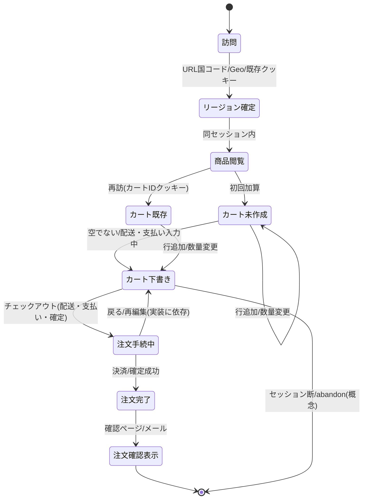
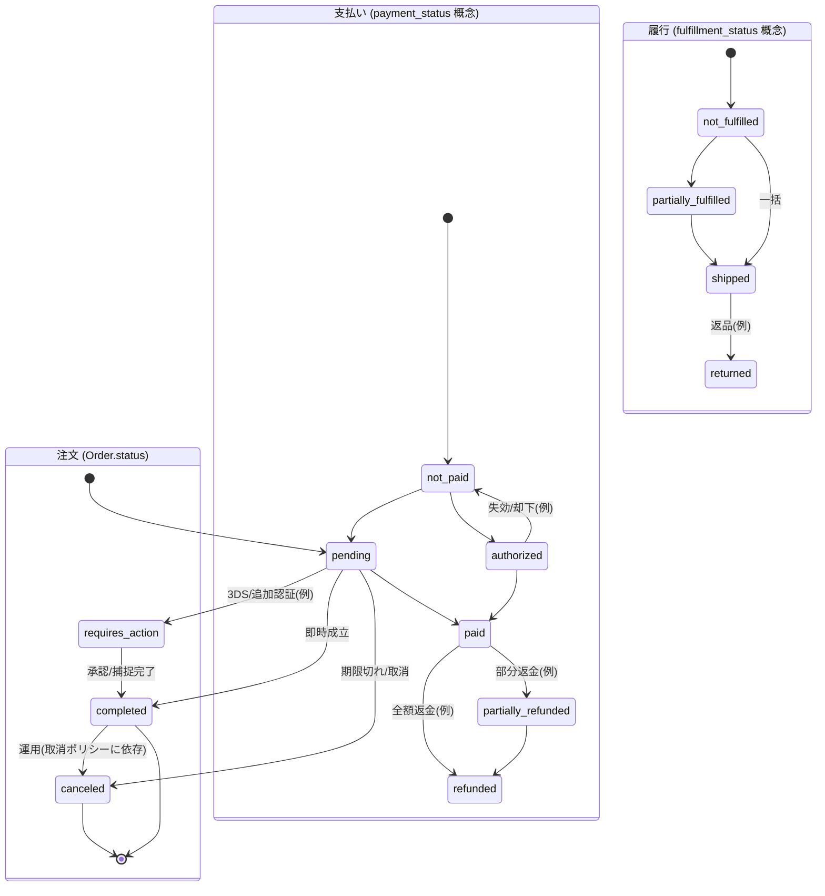
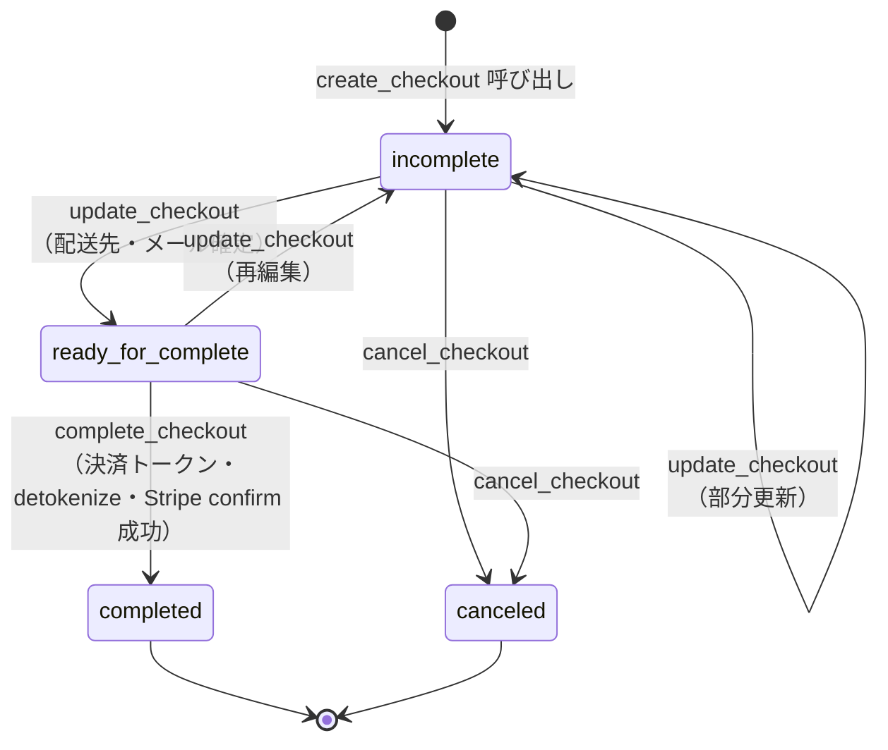
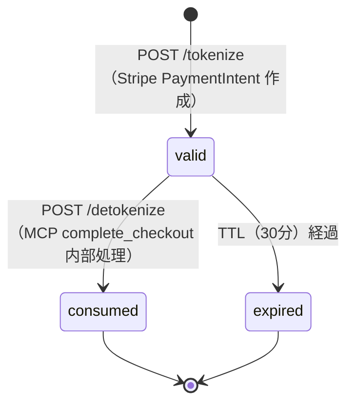
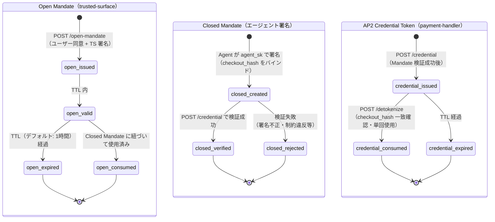
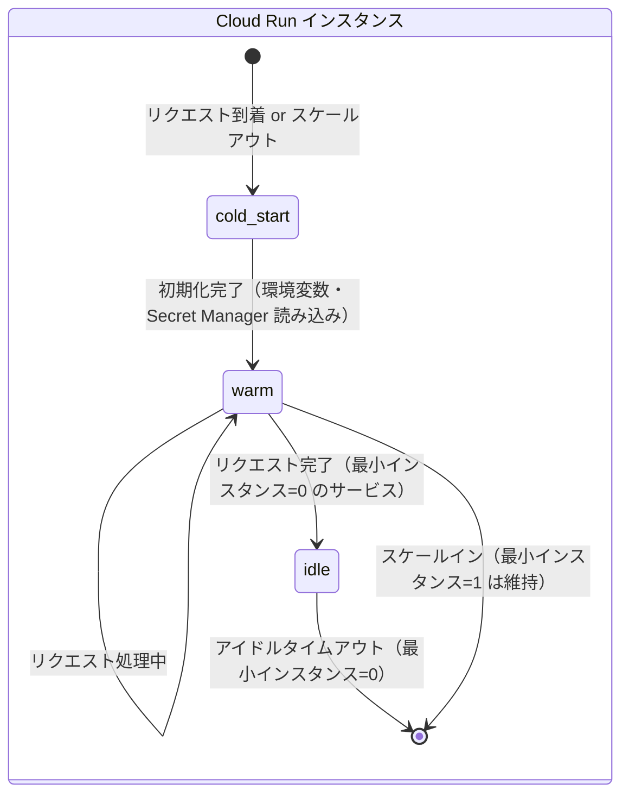

# 状態遷移図（GCPデプロイ版）

本書は `demos/01-sample-ucp_ap2/zz-docs/state-transition.md` をGCPデプロイ構成に対応させたものである。
ビジネスロジックの状態遷移はローカル開発版と同一だが、GCP版では各状態変化が **Cloud SQL（PostgreSQL）** に永続化される点が異なる。

---

## 1. ストアフロント上の主要ユースケース（カート〜注文確認）

GCP版ではストアフロント（`ec-storefront` Cloud Run）からバックエンド（`ec-backend` Cloud Run）への通信がCloud Run内部URLを介する。状態はすべてCloud SQL上のMedusaデータとして永続化される。

---

## 2. 注文・決済の代表的遷移（Medusa コア概念）

`ec-backend`（Cloud Run）上の Medusa v2 が管理する `Order` の **status**・**payment_status**・**fulfillment_status** の遷移。
すべての状態変化は Cloud SQL（PostgreSQL 15）に永続化される。

---

## 3. Checkout セッション状態遷移（UCP / MCP フロー）

`mcp-server`（Cloud Run）が管理するチェックアウトセッション（`b-mcp-server` の in-memory store）の状態遷移。

> GCP版では Cloud Run インスタンスの再起動によりメモリ状態が消失する点に注意。
> 本番化する場合は Memorystore（Redis）への状態永続化を検討する。

---

## 4. UCP 決済トークン状態遷移（payment-handler）

`payment-handler`（Cloud Run）上の `tokenStore`（in-memory）が管理する UCP トークンの状態遷移。

> GCP版では Cloud Run インスタンスの再起動によりトークンが消失する点に注意。
> TTL（デフォルト30分）内に `complete_checkout` → `/detokenize` を完了する必要がある。

---

## 5. AP2 Mandate 状態遷移（Trusted Surface + Credential Provider）

AP2 HNP フローにおける Mandate の状態遷移。`trusted-surface`（Cloud Run）と `payment-handler`（Cloud Run）が連携して管理する。

---

## 6. Cloud Run インスタンス状態（インフラ観点）

GCPデプロイ特有のインフラ状態遷移。Cloud Run のオートスケーリングと最小インスタンス設定に基づく。

**最小インスタンス設定（`design.md` §3.1 参照）:**

| サービス | 最小インスタンス | コールドスタート影響 |
|---|---|---|
| `ec-backend` | 1 | なし（常時ウォーム） |
| `ec-storefront` | 1 | なし |
| `ai-agent-app` | 1 | なし |
| `mcp-server` | 0 | あり（初回リクエストで約2〜5秒の遅延） |
| `payment-handler` | 0 | あり |
| `trusted-surface` | 0 | あり |

> `mcp-server`・`payment-handler`・`trusted-surface` は最小インスタンス=0 のため、非アクティブ時は停止。
> デモ用途では許容可。本番化・低レイテンシ要件がある場合は最小インスタンスを1以上に変更する。

---

## 補足

- **メモリ状態の揮発性**: `mcp-server`・`payment-handler` の in-memory store（チェックアウトセッション・トークンストア）は Cloud Run インスタンスの再起動・スケールインで消失する。本番化の際は Memorystore（Redis）への移行を推奨する。
- **状態の永続化**: `Order`・`Cart`・`PaymentCollection` 等のビジネスエンティティは Cloud SQL（PostgreSQL）に永続化されるため、インスタンス再起動の影響を受けない。
- **Medusa Admin からの手動操作**（ドラフト注文・部分フルフィルメント等）は上記以外の遷移を生む。本図はストアフロント中心の既定フローの俯瞰用である。
