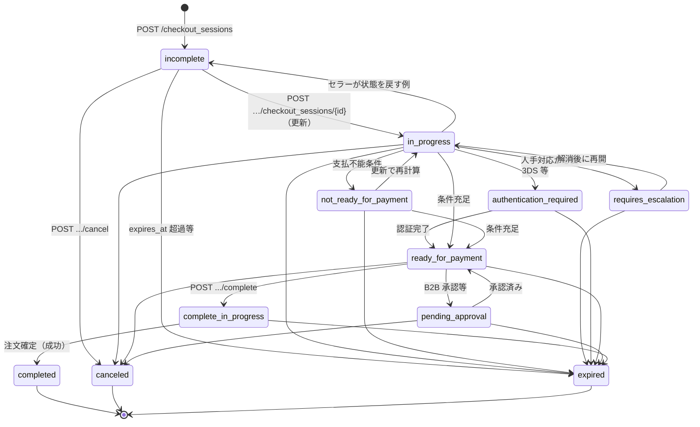

# 調査レポート

## 対象Issue

- **参照**: [atakedemo/agent-commerce-research#3 — ACPの理解](https://github.com/atakedemo/agent-commerce-research/issues/3)
- **タイトル**: ACPの理解
- **概要**: データソースとして [agentic-commerce-protocol / agentic-commerce-protocol](https://github.com/agentic-commerce-protocol/agentic-commerce-protocol) を指定し、**(1) 対象ディレクトリの構造**、**(2) 規格で定めている内容（データモデル、IF 定義、認証認可、決済手段）**、**(3) 個別調査トピック（MCP、`rfcs` 各ファイル、`Signature` ヘッダ）**、**(4) 検討状況（活発な Issue、最新リリースの範囲）** を整理することが求められている。

## 調査対象ディレクトリ

- **パス**: `insights/002-acp-research/`
- **確認したもの**: 本ディレクトリの `README.md`、および Target の参照ミラー（`README.md`、`rfcs/*.md`、`docs/mcp-binding.md`、`spec/2026-01-30/` と `spec/unreleased/` の OpenAPI・OpenRPC・JSON Schema、`changelog/`、Issue 一覧 API の先頭ページ相当）

## エグゼクティブサマリー

ACP（Agentic Commerce Protocol）は、日付版ディレクトリ（例: `2026-01-30`）でスナップショット管理される **beta** のオープン標準であり、マーチャント実装向けに **チェックアウト用 REST API** と **委任決済（Delegate Payment）API**、**Webhook 用 OpenAPI** が分離されている。認証は **Bearer（API Key 形式）** を主とし、決済は **Payment Handlers** による拡張モデルへ移行済みだが、Delegate Payment 側の資格情報は現行テキスト上 **card のみ** と明示されている。**MCP Binding**（チェックアウトを MCP Tools に写像）は **`spec/unreleased` と `docs/mcp-binding.md`** にあり、**日付版 `2026-01-30` スナップショット単体には OpenRPC が含まれない**。`Signature` ヘッダは OpenAPI 上「webhook」と短く書かれつつ、RFC では **リクエスト署名（canonical JSON・`Timestamp`）** と **Webhook の HMAC** が区別される。GitHub の「Releases」は空で版管理は **spec + changelog** が実体であり、コミュニティでは **マーケ・カート・フィード** 等の SEP が相次いで提案されている。

## Issue要約

Issue 本文では次が求められている。

- **問題 / 目的**: ACP プロトコルを理解するための整理。
- **データソース**: `https://github.com/agentic-commerce-protocol/agentic-commerce-protocol`
- **整理項目**:
  - 対象ディレクトリの構造
  - 規格内容: データモデル、IF 定義、認証認可、サポートする決済手段
  - **個別調査トピック**（[Issue #3](https://github.com/atakedemo/agent-commerce-research/issues/3) 追記）:
    1. MCP サポートの状況
    2. `rfcs/` 配下の各 Markdown で定めている内容
    3. ヘッダーにおける `Signature` パラメータの使い方
  - 検討状況: 議論が集中している Issue、最新リリースに含まれる内容
- **成功条件の追加記述**: Issue 本文上は明示されていない（調査・整理が主目的）。

## 分析

### 対象ディレクトリの構造が何を示しているか

公式リポジトリのルート `README.md` に、責務分離に沿ったディレクトリ案内がまとまっている。人間可読の提案は `rfcs/`、機械可読な版は `spec/<YYYY-MM-DD>/`（`openapi/` と `json-schema/`）、同版に揃えた例が `examples/<日付>/`、版ごとの変更説明が `changelog/`、運用と SEP が `docs/`、という **「版スナップショット + 並行ドラフト（unreleased）」** 構造である。これは、HTTP IF・JSON データモデル・説明 RFC・ガバナンスを同じリポジトリで型付きに同期させるための典型的な配置だと解釈できる。

第2階層までの俯瞰（ルート `README.md` の構造抜粋に準拠）:

```
├── rfcs/                 # 設計 RFC（チェックアウト、能力交渉、決済ハンドラ等）
├── spec/
│   ├── 2025-09-29/       # 初回スナップショット
│   ├── 2025-12-12/       # フルフィルメント強化等
│   ├── 2026-01-16/       # 能力交渉（capability negotiation）
│   ├── 2026-01-30/       # 拡張・ディスカウント・Payment Handlers（現行の Latest Stable の一つ）
│   └── unreleased/       # 開発中ドラフト
├── examples/             # 上記各版に対応する例
├── changelog/            # 版別・unreleased の変更ログ
├── docs/                 # governance, SEP, MCP binding, principles 等
├── scripts/              # 補助スクリプト
└── legal/                # CLA 等
```

### データモデルおよび IF 定義

**IF 定義（HTTP）** は `spec/2026-01-30/openapi/` に集約される。

| 表面 | 主な操作 | 役割 |
|------|-----------|------|
| `openapi.agentic_checkout.yaml` | `POST /checkout_sessions`（作成）、`POST|GET /checkout_sessions/{id}`（更新・取得）、`POST .../complete`（完了）、`POST .../cancel`（取消） | エージェント起点のチェックアウト・セッションライフサイクル |
| `openapi.delegate_payment.yaml` | `POST /agentic_commerce/delegate_payment` | 許容額（Allowance）付きで PSP が資格情報をトークン化し、マーチャントが制限利用できるようにする |
| `openapi.agentic_checkout_webhook.yaml` | （別ファイル） | マーチャント側の Webhook 契約（イベント通知側の IF） |

**データモデル** は同名版の `json-schema/` に `schema.agentic_checkout.json`（セッション・注文等の中心）、`schema.delegate_payment.json`、`schema.discount.json`、`schema.extension.json` として分かれている。チェックアウトは `CheckoutSession` を権威ある状態として返し、完了時に `CheckoutSessionWithOrder` で注文を束ねる形が OpenAPI 上の構造と整合する。

### 認証認可

`openapi.agentic_checkout.yaml` では **グローバル `security: [bearerAuth: []]`** とし、`components.securitySchemes.bearerAuth` で **HTTP Bearer（bearerFormat: API Key）** を定義している。リクエストごとに `Authorization` ヘッダ（必須、`Bearer api_key_123` 例）と **必須の `API-Version`（YYYY-MM-DD）**、任意の `Idempotency-Key` / `Request-Id` / `Signature` / `Timestamp` などがパラメータとして繰り返し参照される。

`Signature` / `Timestamp` の説明は **「Webhook 検証向け」** のニュアンスで記載されているが、チェックアウトの各オペレーションの parameters にも含まれる。**エンドユーザの OAuth フローそのものを OpenAPI が包括的に定義するのではなく、マーチャント API へのサーバ間アクセス制御と相関・リプレイ対策のフックを提供する** という分解になっている。

買い手側の状態として、`Buyer` スキーマには `authentication_status`（`authenticated` / `guest` / `requires_signin`）が存在し、セッションは `authentication_required` 等のステータスを取り得る。決済介入（例: 3DS）向けに `authentication_metadata` や 3DS 結果オブジェクトが定義されており、**「ログイン」ではなく主に決済系の強認証介入** と読める。

### サポートする決済手段

`changelog/2026-01-30.md` では **Payment Handlers フレームワーク** が導入され、`capabilities.payment.handlers` で **名前・version・spec URL・PSP・delegate / PCI 要件・instrument schema** などを構造化する方針が示されている。サンプルとしてカード（ブランド交渉、3DS 等）が中心に登場する。

一方、`openapi.delegate_payment.yaml` の説明では **「現在サポートする資格情報タイプは card のみ」** と明示されている。つまり **プロトコル全体としてはハンドラによる拡張余地を規定しつつ、Delegate Payment のコア記述はカード前提** であり、他手段はハンドラ/実装側の追従が必要な領域として残る。

### 状態管理・セッション管理

`CheckoutSession` / `CheckoutSessionBase` の `status` は、少なくとも次の列挙でライフサイクルが表現される: `incomplete`, `not_ready_for_payment`, `requires_escalation`, `authentication_required`, `ready_for_payment`, `pending_approval`, `complete_in_progress`, `completed`, `canceled`, `in_progress`, `expired`。作成・更新・完了・取消の各エンドポイントと、表示用 `messages[]`、介入用 `capabilities`、期限 `expires_at` が組み合わさり、**サーバ権威のセッション状態機械**として設計されている。

OpenAPI は遷移表を 1 枚の表で固定していないため、下図は **列挙値とエンドポイントの意味から整理した概念上の状態遷移**である。実装ごとに到達し得る辺が異なり、失敗経路や `expired` の扱いもセラー実装に依存する。



### 検討状況（Issue）と最新リリースの含意

GitHub API 上、当該リポジトリには **GitHub Releases（タグ）が存在せず**、「最新リリース」は **最新の日付版ディレクトリ + `changelog/<日付>.md`** が実体になる。

`issues?state=all&sort=updated` のRecently updated には、少なくとも次のような **SEP / proposal 系** が同居し、議論の密度が高いテーマが読み取れる。

- **チェックアウト UX / 法令・マーケ**: Marketing Consent on Checkout Complete（Issue/PR 番号 195, 199 付近）
- **表現・相互運用**: Markdown（CommonMark）コンテンツ仕様（例: 212 付近）
- **購入前体験**: Cart Capability、Default Delivery Option、Suggested Pricing、Fulfillment Details on Complete など
- **カタログ・販促**: Product Feeds、Promotions API など
- **運用**: TSC ドキュメント、OpenAPI 検証の chore、CLA 追加

直近の **changelog で固め済み（2026-01-30）** の柱は、能力交渉、Payment Handlers（破壊的変更）、拡張フレームワークとディスカウント拡張、関連する OpenAPI / JSON Schema / 例の更新に要約できる。上記の多くの SEP は **`unreleased` 側や Issue 段階** にあり、次版スナップショット待ち、またはスポンサー承認待ち、という状態が混在する。

### 個別調査トピック（Issue 追補）

以下は [Issue #3 — 個別調査トピック](https://github.com/atakedemo/agent-commerce-research/issues/3) に照らした追加整理である。根拠はミラー上の `docs/`・`rfcs/`・`spec/unreleased/` および各 RFC 本文。

#### 1. MCP サポートの状況

- **位置づけ**: MCP（Model Context Protocol）は ACP にとって **REST に並ぶ第2のトランスポートBinding** として文書化されている（[`docs/mcp-binding.md`](https://github.com/agentic-commerce-protocol/agentic-commerce-protocol/blob/main/docs/mcp-binding.md)）。REST のセマンティクス・JSON Schema は変えず、チェックアウト操作を **MCP の Tools（JSON-RPC 2.0／Streamable HTTP）** に写像する **追加仕様** である。
- **機械可読定義**: `spec/unreleased/openrpc/openrpc.agentic_checkout.json` が **5 つの MCP ツール**（create / get / update / complete / cancel）を OpenRPC で定義する。一方、**日付版スナップショット `spec/2026-01-30/` には OpenRPC が含まれていない**（ミラー上は OpenAPI と JSON Schema のみ）。即ち **MCP Bindingは現行の「リリース済み日付フォルダ」より開発ライン（unreleased）側に存在** する。
- **ディスカバリとの接続**: [`rfcs/rfc.discovery.md`](https://github.com/agentic-commerce-protocol/agentic-commerce-protocol/blob/main/rfcs/rfc.discovery.md) および JSON Schema 上の `transports` は `rest` と `mcp` を列挙し得る旨が述べられ、[SEP #135](https://github.com/agentic-commerce-protocol/agentic-commerce-protocol/issues/135)（MCP Transport Binding）と相互参照される。
- **チェンジログ**: `changelog/unreleased/mcp-transport-binding.md` で OpenRPC・`docs/mcp-binding.md`・MCP 用例 JSON の追加が **Added** として記録されている。
- **未カバー（仕様上の明示）**: `docs/mcp-binding.md` は **Delegate Payment の MCP Bindingはフォローアップ SEP** に委ねるとし、現行Bindingは **Agentic Checkout 表面のみ** としている。

#### 2. `rfcs/` 配下の各 Markdown で定めている内容

`rfcs/` はサブディレクトリを持たず、**各ファイルが RFC（設計・根拠・スコープ）を 1 トピック単位で固定**する。OpenAPI / JSON Schema の**ノルマティブな置換**ではなく、仕様の意図と交互参照の軸になる。

| ファイル | 定めていること（要点） |
|----------|------------------------|
| `rfc.agentic_checkout.md` | **Agentic Checkout（マーチャント REST）** のライフサイクル、Webhook、推奨ヘッダ（`Signature` **`base64url`・RECOMMENDED**、**canonical JSON**＋`Timestamp`）、**リクエスト署名と鮮度検証（SHOULD）**、Webhook 側は別途 **HMAC（`Merchant-Signature`）** との区別。 |
| `rfc.delegate_payment.md` | **委任決済** 1 エンドポイント、Allowance、`Signature` **`base64url` の detached 署名を MUST**（canonical JSON 上の整合性）。 |
| `rfc.delegate_authentication.md` | **委任認証（3DS2・ブラウザ等）** の API。`Signature` は **`base64url`・REQUIRED**、検証は **MUST**。 |
| `rfc.capability_negotiation.md` | **`capabilities` 交差**によるエージェント／セラー間の能力宣言と不整合の早期検出。 |
| `rfc.payment_handlers.md` | **Payment Handlers** フレームワーク（宣言・delegate／PCI・instrument schema 等）。 |
| `rfc.seller_backed_payment_handler.md` | **`dev.acp.seller_backed.*`** パターン（保存カード・ギフトカード等をセラー側で解決）。 |
| `rfc.extensions.md` | **ACP 拡張の枠組み**（能力交渉と連動したオプション機能）。 |
| `rfc.discount_extension.md` | **ディスカウント拡張**（コード・適用結果・自動割引・エラーコード）。 |
| `rfc.discovery.md` | **`/.well-known/acp.json`** による能力・版・`transports`（`mcp` 含み得る）の事前取得。 |
| `rfc.affiliate_attribution.md` | **`affiliate_attribution`** オブジェクトによるアフィリエイト帰属。 |
| `rfc.intent_traces.md` | **キャンセル時のインテントトレース**（放棄理由の構造化）。 |
| `rfc.orders.md` | **注文スキーマのポスト購入拡充**（フルフィルメント・調整等）。 |

#### 3. ヘッダーにおける `Signature` パラメータの使い方

**OpenAPI（チェックアウト）** では `components.parameters.Signature` が **`in: header`・`required: false`** で、**説明文は「HMAC signature for webhook verification」** に限っており、**リクエスト署名のアルゴリズム・ペイロード・鍵運用は OpenAPI のこの 1 行では確定しない**（Webhook の `Merchant-Signature` 形式と混同しやすい表現になっている）。

**RFC 側の整理（チェックアウト＝`rfc.agentic_checkout.md`）** は次のとおり読み分けられる。

- **エージェント→マーチャントの REST リクエスト**: **`Signature` は `base64url` で RECOMMENDED**。**canonical JSON** 上に署名し、**`Timestamp`（RFC 3339）と組み合わせて鮮度を bounded skew で SHOULD 検証**。**許容アルゴリズムは帯域外で公開する**想定。
- **Webhook（マーチャント→プラットフォーム）**: RFC では **別物**として明示され、**`Merchant-Signature` の HMAC 検証**を参照（OpenAPI `openapi.agentic_checkout_webhook.yaml` 側で Stripe 型 `t=...,v1=...` と raw body の HMAC-SHA256 等が定義される流れと整合）。**この経路では `Signature` ヘッダは使われない**。

**他 API の `Signature`（同一ヘッダ名・意味は表面ごとに異なる）**:

- **`rfc.delegate_payment.md`**: クライアントは **detached 署名を MUST**・`base64url`。
- **`rfc.delegate_authentication.md`**: **`Signature` REQUIRED**、canonical JSON＋`Timestamp` の **MUST 検証**。

**場面別整理: 署名対象データと秘密鍵（調査結果）**

RFC は **アルゴリズム（Ed25519 / ES256 等）を帯域外で公開する**前提が繰り返される。以下の **「署名対象」** は、各 RFC にある **canonical JSON シリアライズ**（または **detached 署名**としてそれに対応するバイト列）を指す。informative として RFC 8785（JCS）に言及があるが、**ノルマティブなカノニカライズ手順の完全な固定**は本文だけでは細部まで特定できない。

| 場面 | 誰が `Signature` を付けるか（呼び出し側） | 署名の対象となるデータ | 署名に用いる秘密情報（鍵）の所在 | 検証側と公開素材 |
|------|------------------------------------------|------------------------|----------------------------------|-------------------|
| **Agentic Checkout（REST）** — `POST` 系（create / update / complete / cancel） | RFC 上の **Client**（§3.1 は「**sent by ChatGPT**」）。実装では **エージェント面の統合クライアント**が相当。 | **HTTP リクエストの JSON 本文**を canonical JSON 化したデータに対する署名。**`Timestamp` は別ヘッダ**で鮮度検証に用いる。 | **呼び出し側が保持する非対称秘密鍵**（クライアント署名）。 | **マーチャント（受信サーバ）** が **帯域外で公開されたクライアント公開鍵**等で検証 **SHOULD**（`Timestamp` は bounded clock skew）。 |
| **Agentic Checkout（REST）** — `GET .../checkout_sessions/{id}` | 同一 RFC でヘッダ集合に `Signature` が列挙されるが、**本文なし GET の canonical 対象は RFC 抜粋内にノルマティブに定義されていない**。 | （不確定）**空本文**や **メソッド＋パス等**を含む規約は **仕様外**でプロファイル化が要る可能性。 | クライアント側秘密鍵を **一般的なリクエスト署名**として想定する記述はあるが、GET の対象は未特定。 | マーチャント。 |
| **Delegate Payment** — `POST /agentic_commerce/delegate_payment` | **Client**（トークン化リクエスト送信者。文脈上 **エージェント／ウォレット／決済面クライアント**が該当しうる）。 | **リクエスト本文**を canonical JSON 化したものへの **detached 署名**（`payment_method`・`allowance` 等を含む）。 | **その Client の非対称秘密鍵**（RFC **「its private key」**）。 | **Delegate Payment サーバ**が **帯域外の公開鍵・許容アルゴリズム**で検証 **SHOULD**。 |
| **Delegate Authentication** | **クライアント**（認証 API を呼ぶアプリ／エージェント）。 | **canonical JSON** 化した **リクエスト本文**（**identity verification over canonical request**）。 | **クライアントの非対称秘密鍵**。 | **認証プロバイダ（サーバ）** が整合性を **MUST 検証**。 |
| **MCP（Checkout ツール）** | **MCP クライアント**（ツール呼び出し送信者）。 | HTTP における `Signature` は **`meta.signature`** に対応。**セマンティクスは REST の protocol メタ＋`payload` と揃える**が、**署名対象バイト列を HTTP のどの合成と完全一致させるかは `docs/mcp-binding.md` のヘッダ写像以上には本文で固定されていない**。 | `meta.signature` を送るなら **クライアント側の署名鍵素材**（Request signing）。 | **MCP サーバ**（マーチャント REST プロキシなら下流との **鍵・検証責務の割当**は実装依存）。 |

**Webhook 対照（`Signature` ヘッダではない）**: **`Merchant-Signature`**。対象は **`timestamp + "." + raw_body`**（OpenAPI）。**HMAC-SHA256 と共有秘密**。**マーチャントと受信者が事前共有**する対称鍵であり、上表の **クライアント非対称秘密鍵とは別系統**。

**MCP Binding（`docs/mcp-binding.md`）**: HTTP の `Signature` は **`meta.signature` に対応**（Required: **No**、注記は **Request signing**）。**`Authorization` は `meta` に載せず** MCP 接続レベルで扱う。

**調査上の注意**: 実装では **「どの相手が・どの本文に・どのアルゴリズムで `Signature` を付けるか」は表面（Checkout / Delegate Payment / Delegate Authentication）で要件が異なる**。チェックアウト OpenAPI の「webhook」記述だけを **購読者向け REST の署名仕様**と読み替えない方がよい。**GET の署名対象**および **MCP の `meta.signature` の正確なオクテット列**は、**プロファイルまたは今後の明文化**に期待が残る。

## 未解決事項・不足情報

- **GitHub Releases / タグが空** のため、「最新リリース」を Git の tag として機械的に指すことはできない。運用上の「latest stable」は README と `spec/2026-01-30` の位置づけに依存する。
- 本調査は **リポジトリの公開テキストと Issue 一覧** に基づく。**Discussion の要約やメンテナ毎の公式優先度付けは未実施**（open 一覧の機械的分類は `open-issues-filtered.md` を参照）。
- `Signature` / `Timestamp` をチェックアウト操作にまで要求するかは、実装プロファイル次第であり、OpenAPI 上は `required: false` と **parameters での参照** にとどまる部分がある。**チェックアウト OpenAPI の `Signature` 説明が「webhook」中心で、RFC（`rfc.agentic_checkout.md`）のリクエスト署名説明と字面が一致しない**。**統合ガイドまたは実装者向けの署名プロファイル**で是正されるかは未確認。
- **本文の無い `GET /checkout_sessions/{id}`** で **`Signature` をどのバイト列に対して計算するか** は、`rfc.agentic_checkout.md` の引用範囲では **ノルマティブに確定しない**。MCP の **`meta.signature`** も **HTTP 変換時の正確な署名対象**は OpenRPC／binding 本文だけでは完全には固定されない。

## 次のアクション

- 実装を追う場合は **OpenAI / Stripe の実装ドキュメント**（公式 README 記載のリンク）と、`spec/2026-01-30` を突き合わせる。
- 決済手段のロードマップは **`rfcs/rfc.payment_handlers.md` と Delegate Payment OpenAPI の差分**、および Payment 関連 open Issue を定期追跡する。
- 次版取り込み予定のテーマは **`changelog/unreleased/` と `spec/unreleased/`** をウォッチする。
- **実施済み（2026-04-05）**: open Issue/PR の一覧と **暫定優先度（P1–P3）** を `insights/002-acp-research/open-issues-filtered.md` に記録した。当該リポジトリでは **SEP 用の GitHub ラベルは付与されておらず**、API 上も open 93 件では `labels` が空だったため、**タイトル（`SEP:` / `[SEP]` 等）とキーワード**で近似分類している。環境に `gh` がある場合のラベルフィルタ例も同メモに併記した。

## 参照ファイル

- `insights/002-acp-research/README.md`
- `insights/002-acp-research/open-issues-filtered.md`（open Issue/PR 一覧・暫定優先度・`gh` 例）
- （Target）`https://github.com/agentic-commerce-protocol/agentic-commerce-protocol/blob/main/README.md`
- （Target）[`docs/mcp-binding.md`](https://github.com/agentic-commerce-protocol/agentic-commerce-protocol/blob/main/docs/mcp-binding.md)、`spec/unreleased/openrpc/openrpc.agentic_checkout.json`（個別調査: MCP）
- （Target）`rfcs/rfc.agentic_checkout.md`、`rfc.delegate_payment.md`、`rfc.delegate_authentication.md`（個別調査: `Signature`）
- （Target）`spec/2026-01-30/openapi/openapi.agentic_checkout.yaml`、同 `openapi.delegate_payment.yaml`
- （Target）`changelog/2026-01-30.md`、`changelog/unreleased/mcp-transport-binding.md`

## 主要ファクト

- Target リポジトリの説明では ACP は **OpenAI と Stripe が保守する beta** の相互作用モデルである（ルート `README.md`）。
- 版管理は **Git tag ではなく `spec/<YYYY-MM-DD>/` + `changelog/`** を主とし、`unreleased` が開発ライン（ルート `README.md`）。
- チェックアウト API は **4 系統の path**（create / update+get / complete / cancel）でセッションを操作する（`openapi.agentic_checkout.yaml`）。
- セッション `status` は **11 値の列挙**で、支払準備・介入・完了・失効などを表す（同一 OpenAPI `CheckoutSessionBase`）。
- API メタとして **Bearer 認証** と **必須 `API-Version` ヘッダ** が定義されている（同一ファイル `securitySchemes` / `parameters`）。
- Delegate Payment は **`POST /agentic_commerce/delegate_payment`** で、`allowance` と `payment_method` を受け、**現行仕様テキストでは資格情報種別は card のみ**（`openapi.delegate_payment.yaml`）。
- 2026-01-30 の変更ログでは **Capability Negotiation**、**Payment Handlers（破壊的変更）**、**Extensions + Discount 拡張** が主要機能として列挙されている（`changelog/2026-01-30.md`）。
- GitHub API 上 **releases と tags の配列は空** であり、版の「公式な打ち出し」は changelog と spec ディレクトリに寄せられている。
- Issue 一覧（更新日時ソートの先頭付近）では **マーケティング同意、CommonMark、カート、プロダクトフィード／プロモーション、配送デフォルト** などが続けて提案されている（GitHub REST issues 応答）。
- 2026-04-05 時点の **open Issue/PR 93 件**では **GitHub `labels` が 1 件も付いていない** API 応答であった。`open-issues-filtered.md` に全件表と **P1–P3 の暫定優先度**、SEP らしいタイトルの抜粋を残している。
- **MCP**: `docs/mcp-binding.md` と `spec/unreleased/openrpc/` で **Checkout の 5 操作を MCP Tools に対応付け**；`spec/2026-01-30/` には **OpenRPC が無い**（ミラー上）。
- **`rfcs/`**: 少なくとも **12 本**の RFC が **チェックアウト・委任決済／認証・能力交渉・ハンドラ・拡張・ディスカバリ等**を人間可読に分割定義。
- **`Signature`**: チェックアウト RFC では **canonical JSON＋`Timestamp`・アルゴリズムは帯域外**で **RECOMMENDED**；Delegate Authentication では **REQUIRED**；Delegate Payment では detached **MUST**；Webhook 側は **`Merchant-Signature`（HMAC）** が別系統。OpenAPI の `Signature` ヘッダ説明は **webhook 用文言**に寄せられており RFC と短絡できない。
- **`Signature` 場面別（鍵と対象）**: **Checkout／Delegate Payment／Delegate Authentication の送信者**は **自らの非対称秘密鍵**で、主に **canonical JSON 化したリクエスト本文**（DP は **detached**）に署名する前提。**検証側**は **受信サーバが帯域外の公開鍵方針**で検証（Auth は **MUST**、他は **SHOULD** 等、RFC による）。**Webhook** は **`Signature` ではなく `Merchant-Signature`** で **`timestamp + "." + raw_body`** に **共有秘密の HMAC**。
