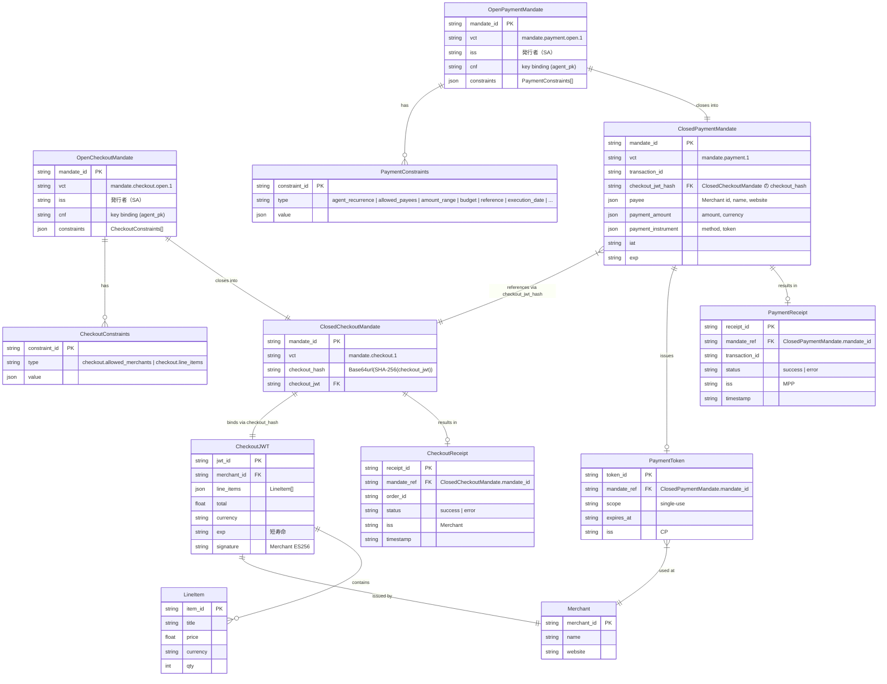

# ER 図

## コアデータモデル



---

## Mandate 制約一覧

### Checkout 制約

| 制約タイプ | 説明 | 検証者 |
| --- | --- | --- |
| `checkout.allowed_merchants` | 許可マーチャントを制限 | Merchant |
| `checkout.line_items` | 許容商品・数量の制限（最大流アルゴリズムで評価） | Merchant |

### Payment 制約

| 制約タイプ | 説明 | 検証者 |
| --- | --- | --- |
| `agent_recurrence` | 繰り返し頻度・発生回数の制限 | CP / MPP |
| `allowed_payees` | 許可マーチャントの制限 | CP / MPP |
| `allowed_payment_instruments` | 許可決済手段の制限 | CP |
| `allowed_pisps` | 許可 PSP の制限 | CP |
| `amount_range` | 最小・最大金額の設定 | CP / MPP |
| `budget` | 総支出上限の設定 | CP / MPP |
| `reference` | 関連 Checkout Mandate の参照 | CP |
| `execution_date` | 有効実行日時範囲の指定 | CP / MPP |

---

## SD-JWT VDC 構造

AP2 v0.2 では Mandate を **SD-JWT（Selective Disclosure JWT）** 形式で表現する。

```
mandate_sdjwt = issuer_signed_jwt + "~" + [disclosed_claim_1 + "~"] + [kb_jwt]
```

| 部品 | 役割 |
| --- | --- |
| issuer_signed_jwt | iss（SA または TS）が ES256 で署名 |
| disclosed_claim | 検証者に開示する制約クレーム |
| kb_jwt（Key Binding JWT） | agent_sk または user_sk で署名。`transaction_data` に CheckoutJWT ハッシュ等を含む |

---

## バージョニング（`vct` クレーム）

| `vct` 値 | Mandate 種別 |
| --- | --- |
| `mandate.checkout.open.1` | Open Checkout Mandate |
| `mandate.checkout.1` | Closed Checkout Mandate |
| `mandate.payment.open.1` | Open Payment Mandate |
| `mandate.payment.1` | Closed Payment Mandate |
