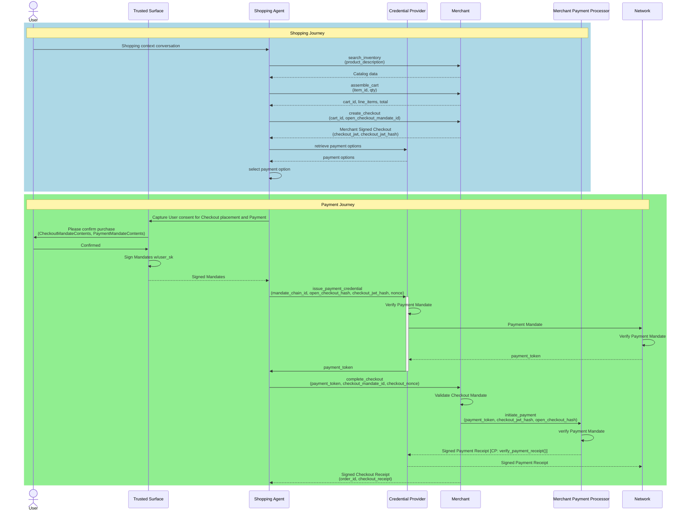
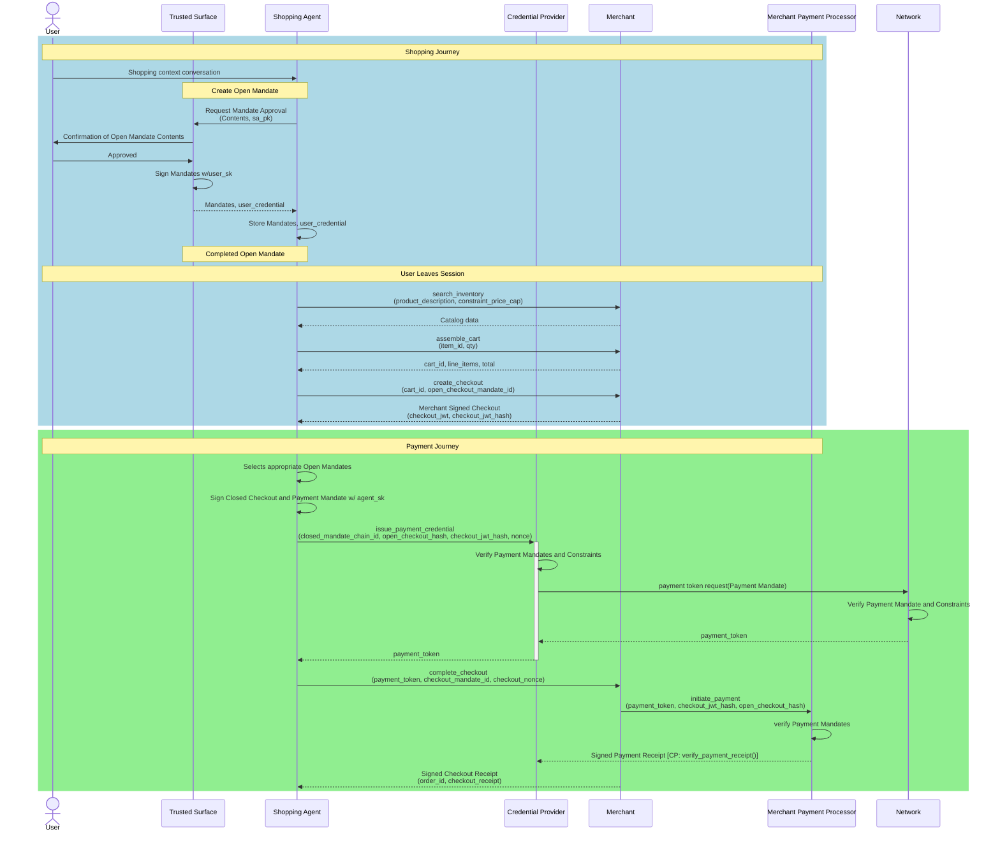

# シーケンス図

> **公式参照画像（AP2リポジトリ `docs/assets/`）**
>
> | フロー | 全体図 | ショッピングフェーズ | 決済フェーズ |
> |---|---|---|---|
> | Human Present | [ap2_hp_flow.svg](https://raw.githubusercontent.com/google-agentic-commerce/AP2/main/docs/assets/ap2_hp_flow.svg) | [ap2_hp_shopping.svg](https://raw.githubusercontent.com/google-agentic-commerce/AP2/main/docs/assets/ap2_hp_shopping.svg) | [ap2_hp_payment.svg](https://raw.githubusercontent.com/google-agentic-commerce/AP2/main/docs/assets/ap2_hp_payment.svg) |
> | Human Not Present | [ap2_hnp_flow.svg](https://raw.githubusercontent.com/google-agentic-commerce/AP2/main/docs/assets/ap2_hnp_flow.svg) | [ap2_hnp_shopping.svg](https://raw.githubusercontent.com/google-agentic-commerce/AP2/main/docs/assets/ap2_hnp_shopping.svg) | [ap2_hnp_payment.svg](https://raw.githubusercontent.com/google-agentic-commerce/AP2/main/docs/assets/ap2_hnp_payment.svg) |
>
> **公式画像との整合性**: 本 Mermaid 図は `docs/ap2/flows.md` の記述と照合済み。全体的に一致。HNP の Phase 1a（HP 期）と Phase 1b（HNP 期）を公式は分割表示するが、本図では `Note` + `rect` で区切る形で統合している。

## Human Present フロー

ユーザが各ステップで承認に直接関与する標準購買フロー。

---

## Human Not Present フロー

ユーザが事前に制約付き Open Mandate を承認し、エージェントが自律的に購買・決済を完了するフロー。

---

## 登場ロールの凡例

| ロール | 略称 | 説明 |
| --- | --- | --- |
| Shopping Agent | SA | 商品探索・チェックアウト・購買実行を担当する LLM エージェント |
| Trusted Surface | TS | ユーザ同意を取得する非エージェント UI（非決定的コード禁止） |
| Merchant | MA | カタログ提供・Checkout JWT 署名・注文確定を担当 |
| Credential Provider | CP | 決済手段管理・トークン発行・マンデート検証を担当 |
| Network | NW | 決済クレデンシャルの検証・payment_token 発行を担当 |
| Merchant Payment Processor | MPP | 最終的な決済処理・レシート発行を担当 |

## MCP ツール補記の凡例

| ツール名 | MCP サーバ | 補記箇所 |
| --- | --- | --- |
| `search_inventory` | merchant_agent_mcp | Return Catalogue（商品検索） |
| `assemble_cart` | merchant_agent_mcp | Add items to cart |
| `create_checkout` | merchant_agent_mcp | Create Checkout（Checkout JWT 発行） |
| `complete_checkout` | merchant_agent_mcp | Checkout 完了・注文確定 |
| `issue_payment_credential` | credentials_provider_mcp | Payment Mandate → payment_token 発行 |
| `verify_payment_receipt` | credentials_provider_mcp | MPP からのレシート受領時に CP 側で実行 |
| `initiate_payment` | merchant_payment_processor_mcp | Merchant → MPP 決済開始 |
| retrieve payment options | — | サンプル実装に対応 MCP ツールなし |
