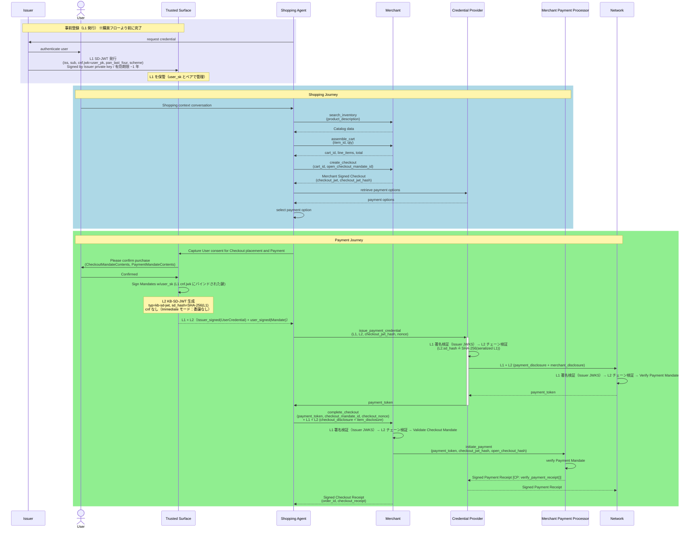
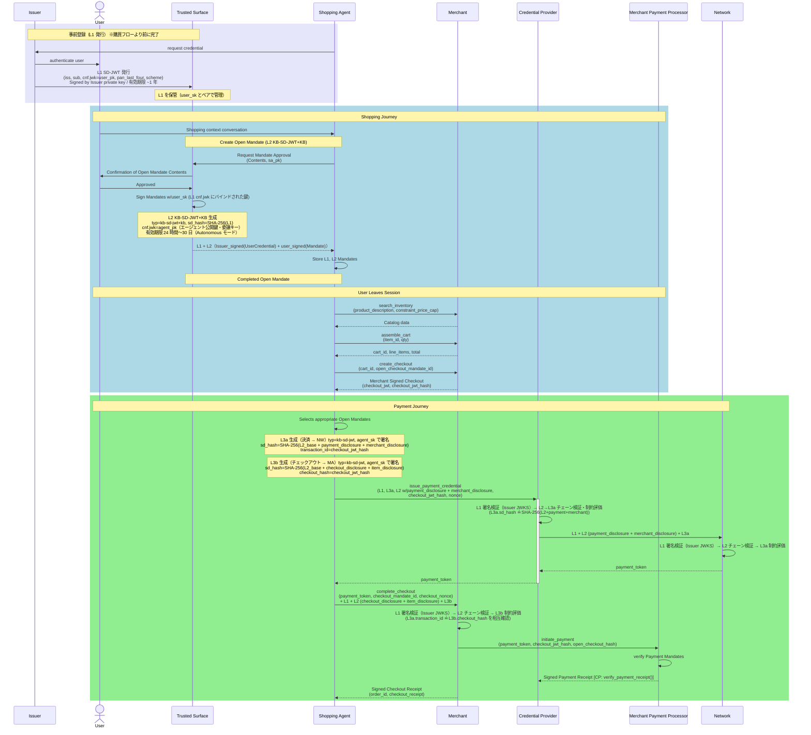

# シーケンス図

> **公式参照画像（AP2リポジトリ `docs/assets/`）**
>
> | フロー | 全体図 | ショッピングフェーズ | 決済フェーズ |
> |---|---|---|---|
> | Human Present | [ap2_hp_flow.svg](https://raw.githubusercontent.com/google-agentic-commerce/AP2/main/docs/assets/ap2_hp_flow.svg) | [ap2_hp_shopping.svg](https://raw.githubusercontent.com/google-agentic-commerce/AP2/main/docs/assets/ap2_hp_shopping.svg) | [ap2_hp_payment.svg](https://raw.githubusercontent.com/google-agentic-commerce/AP2/main/docs/assets/ap2_hp_payment.svg) |
> | Human Not Present | [ap2_hnp_flow.svg](https://raw.githubusercontent.com/google-agentic-commerce/AP2/main/docs/assets/ap2_hnp_flow.svg) | [ap2_hnp_shopping.svg](https://raw.githubusercontent.com/google-agentic-commerce/AP2/main/docs/assets/ap2_hnp_shopping.svg) | [ap2_hnp_payment.svg](https://raw.githubusercontent.com/google-agentic-commerce/AP2/main/docs/assets/ap2_hnp_payment.svg) |
>
> **公式画像との整合性**: 本 Mermaid 図は `docs/ap2/flows.md` の記述と照合済み。全体的に一致。HNP の Phase 1a（HP 期）と Phase 1b（HNP 期）を公式は分割表示するが、本図では `Note` + `rect` で区切る形で統合している。
>
> **Verifiable Intent 対応について**: 本図は [Verifiable Intent 仕様](https://github.com/agent-intent/verifiable-intent/blob/main/spec/credential-format.md) の L1 SD-JWT フローを反映するため、AP2 公式図にない **Issuer（IS）** 参加者と **L1 発行フェーズ** を追加している。公式 AP2 図は L1 プロビジョニングを前提条件として省略しているが、本図では明示的に示す。
>
> **L1 の発行先と提示先について**: AP2 の整理では L1 は IS から **Trusted Surface（TS）に発行**される（[mandate_delegation_trusted_agent_provider.svg](https://raw.githubusercontent.com/google-agentic-commerce/AP2/main/docs/assets/mandate_delegation_trusted_agent_provider.svg) 参照）。TS は L1 を保管し、ユーザ承認後に **L1 + L2 をセットで SA に渡す**。SA はその後 CP・MA・NW すべてに L1 を転送し、各検証者は Issuer の JWKS エンドポイントで L1 署名を検証した上で L2/L3 のチェーン検証を行う。

## Human Present フロー

ユーザが各ステップで承認に直接関与する標準購買フロー（Verifiable Intent: **Immediate モード**）。

---

## Human Not Present フロー

ユーザが事前に制約付き Open Mandate を承認し、エージェントが自律的に購買・決済を完了するフロー（Verifiable Intent: **Autonomous モード**）。

---

## 登場ロールの凡例

| ロール | 略称 | 説明 |
| --- | --- | --- |
| Issuer | IS | L1 SD-JWT を発行・署名する金融機関または決済ネットワーク。ユーザ身元と公開鍵（cnf.jwk）をバインドした根拠証明を提供する |
| Shopping Agent | SA | 商品探索・チェックアウト・購買実行を担当する LLM エージェント。HNP では L3a/L3b を agent_sk で署名 |
| Trusted Surface | TS | ユーザ同意を取得する非エージェント UI（非決定的コード禁止）。L2 KB-SD-JWT を user_sk で署名して生成する |
| Merchant | MA | カタログ提供・Checkout JWT 署名・注文確定を担当 |
| Credential Provider | CP | L1 Wallet 保管・L2/L3 チェーン検証・payment_token 発行を担当 |
| Network | NW | 決済クレデンシャルの検証・payment_token 発行を担当 |
| Merchant Payment Processor | MPP | 最終的な決済処理・レシート発行を担当 |

## Verifiable Intent 層と AP2 Mandate の対応

| VI 層 | typ | 署名者 | AP2 Mandate | sd_hash の計算対象 |
| --- | --- | --- | --- | --- |
| L1 | `sd+jwt` | Issuer | User Credential | なし（ルート） |
| L2（Immediate） | `kb-sd-jwt` | Trusted Surface（user_sk） | Closed Checkout + Payment Mandate | SHA-256(serialized L1) |
| L2（Autonomous） | `kb-sd-jwt+kb` | Trusted Surface（user_sk） | Open Checkout + Payment Mandate | SHA-256(serialized L1) |
| L3a | `kb-sd-jwt` | Shopping Agent（agent_sk） | Closed Payment Mandate → NW へ提出 | SHA-256(L2_base + payment_disc + merchant_disc) |
| L3b | `kb-sd-jwt` | Shopping Agent（agent_sk） | Closed Checkout Mandate → MA へ提出 | SHA-256(L2_base + checkout_disc + item_disc) |

## MCP ツール補記の凡例

| ツール名 | MCP サーバ | 補記箇所 |
| --- | --- | --- |
| `search_inventory` | merchant_agent_mcp | Return Catalogue（商品検索） |
| `assemble_cart` | merchant_agent_mcp | Add items to cart |
| `create_checkout` | merchant_agent_mcp | Create Checkout（Checkout JWT 発行） |
| `complete_checkout` | merchant_agent_mcp | Checkout 完了・注文確定 |
| `issue_payment_credential` | credentials_provider_mcp | Payment Mandate → payment_token 発行 |
| `verify_payment_receipt` | credentials_provider_mcp | MPP からのレシート受領時に CP 側で実行 |
| `initiate_payment` | merchant_payment_processor_mcp | Merchant → MPP 決済開始 |
| retrieve payment options | — | サンプル実装に対応 MCP ツールなし |
