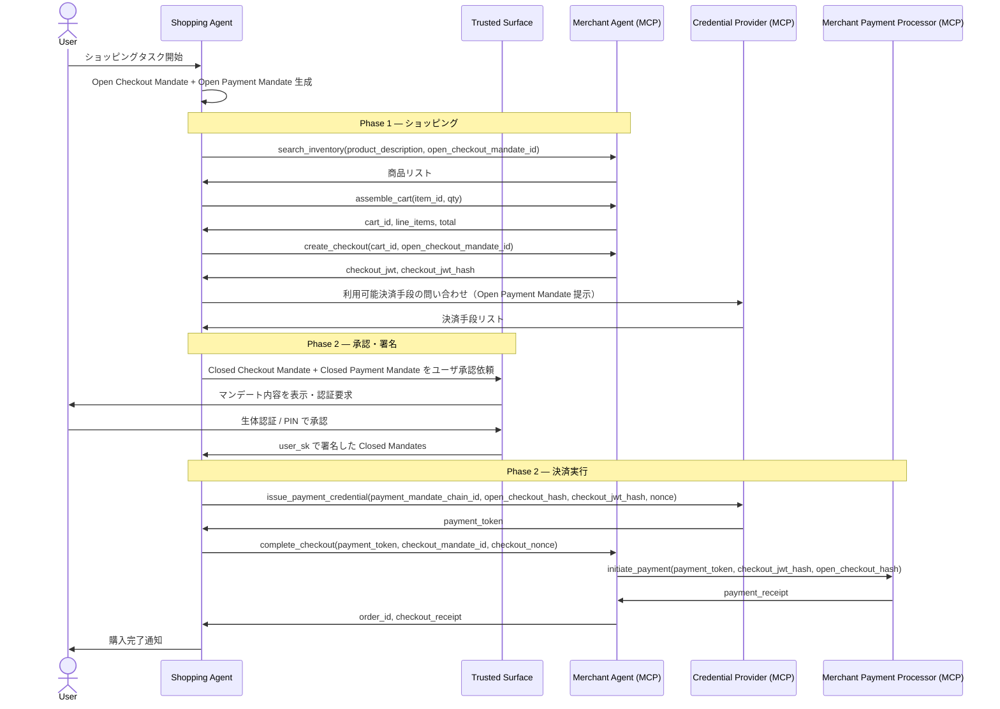
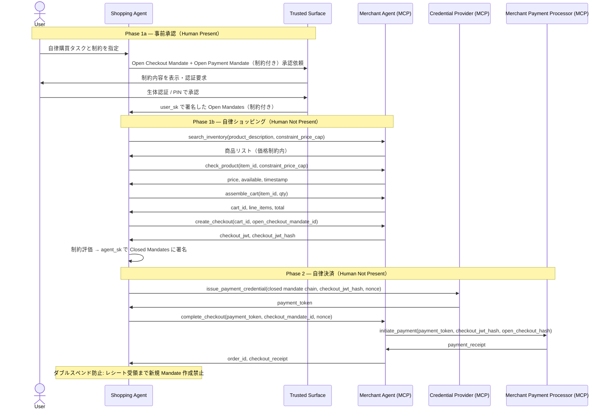

# シーケンス図

## Human Present フロー

ユーザが各ステップで承認に直接関与する標準購買フロー。

---

## Human Not Present フロー

ユーザが事前に制約付き Open Mandate を承認し、エージェントが自律的に購買・決済を完了するフロー。

---

## 登場ロールの凡例

| ロール | 略称 | 説明 |
| --- | --- | --- |
| Shopping Agent | SA | 商品探索・チェックアウト・購買実行を担当する LLM エージェント |
| Trusted Surface | TS | ユーザ同意を取得する非エージェント UI（非決定的コード禁止） |
| Merchant Agent | MA | カタログ提供・Checkout JWT 署名・注文確定を担当 |
| Credential Provider | CP | 決済手段管理・トークン発行・SD-JWT 検証を担当 |
| Merchant Payment Processor | MPP | 最終的な決済処理・レシート発行を担当 |
