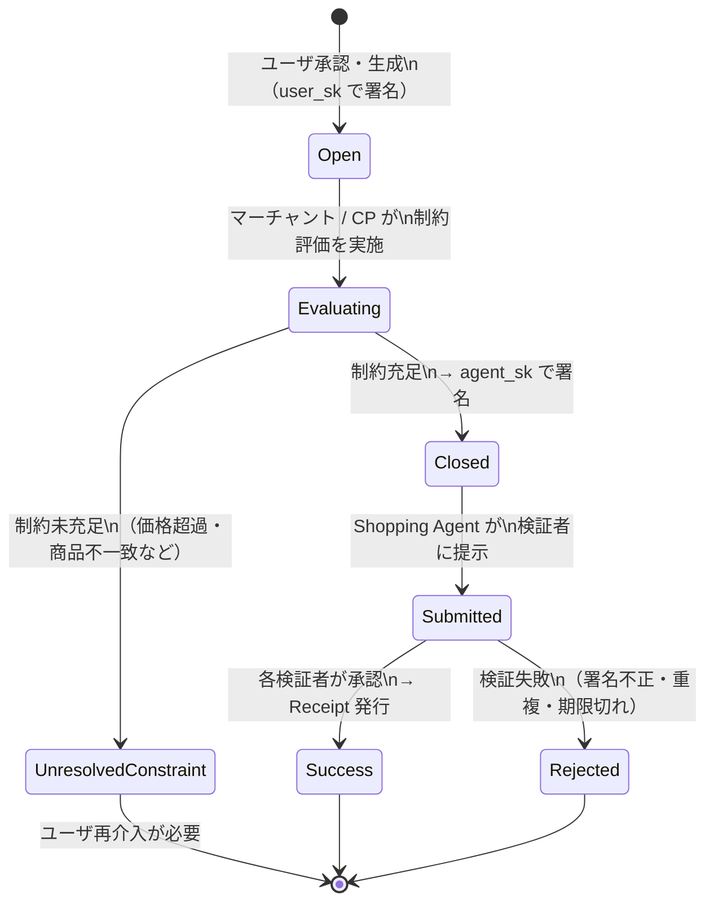
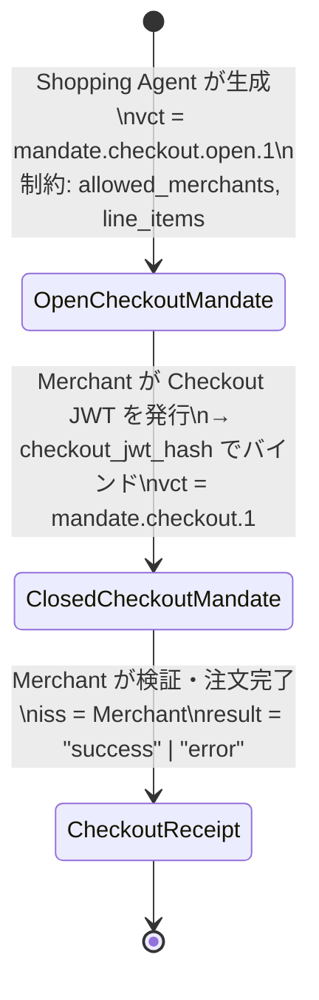
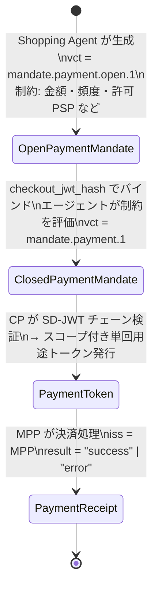
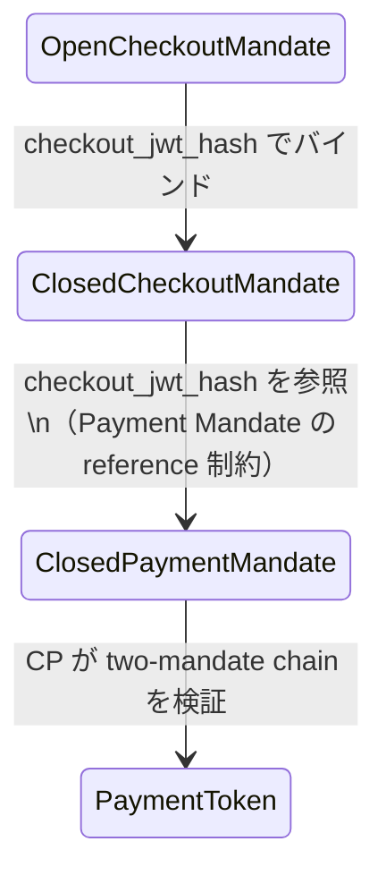

# 状態遷移図

## Mandate ライフサイクル（全体）

---

## Checkout Mandate 状態遷移

### Checkout Mandate のフィールド変化

| 状態 | `vct` | 追加されるフィールド |
| --- | --- | --- |
| Open | `mandate.checkout.open.1` | constraints（allowed_merchants, line_items） |
| Closed | `mandate.checkout.1` | checkout_hash, checkout_jwt |
| Receipt | — | order_id, status, iss（Merchant） |

---

## Payment Mandate 状態遷移

### Payment Mandate のフィールド変化

| 状態 | `vct` | 追加されるフィールド |
| --- | --- | --- |
| Open | `mandate.payment.open.1` | constraints（amount_range, budget, recurrence など） |
| Closed | `mandate.payment.1` | transaction_id, payee, payment_amount, payment_instrument, checkout_jwt_hash |
| Receipt | — | mandate_ref, status, iss（MPP） |

---

## Mandate チェーンの連結

> `checkout_jwt_hash` を用いた暗号ハッシュバインディングにより、CheckoutMandate と PaymentMandate が単一トランザクションに恒久的に紐付けられる。

---

## ダブルスペンド防止ルール

- Shopping Agent は、レシートを受け取るまで同一スコープで新規 Open Mandate を作成してはならない。
- Closed Mandate の提示後、Action Receipt 受領前に重複 Mandate を送信した場合、検証者はこれを拒否する。
