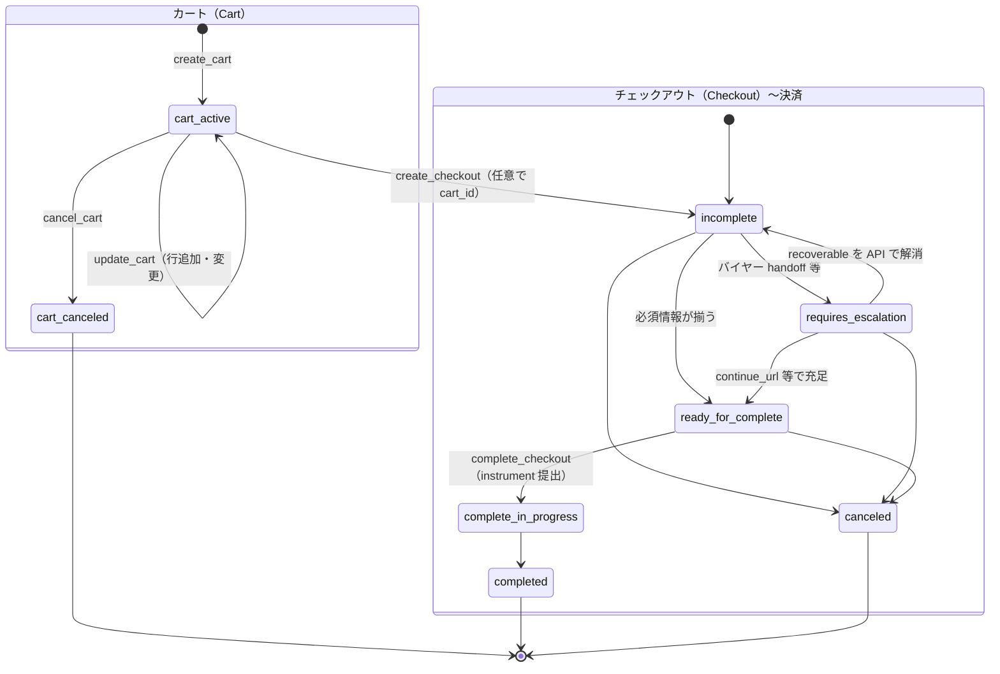

# 調査レポート

## 対象Issue

- **参照**: [UCPのプロトコル理解＆設計パターン整理 #5](https://github.com/atakedemo/agent-commerce-research/issues/5)
- **タイトル**: UCPのプロトコル理解＆設計パターン整理
- **本文の要旨**: [Universal-Commerce-Protocol/ucp](https://github.com/Universal-Commerce-Protocol/ucp) を規格全体のデータソースとし、公式サンプルとして A2A（[samples/.../a2a](https://github.com/Universal-Commerce-Protocol/samples/tree/main/a2a)）と REST（[samples/.../rest/python/server](https://github.com/Universal-Commerce-Protocol/samples/tree/main/rest/python/server)）を挙げたうえで、規格リポジトリのディレクトリ構造、データモデル・IF 定義・認証認可、サポート決済手段、両サンプル実装の差、さらに本家リポジトリで議論が集中している Issue と最新リリースの含意について整理することが求められる。
- **[追加調査コメント（2026-04-29）](https://github.com/atakedemo/agent-commerce-research/issues/5#issuecomment-4341120745)**: 「現在議論が進められている Issue」および「クローズ済み Issue」の**起票者（起票元）を整理**し、更新の活発な open Issue については**直近更新の 20 件**に限定する。

## 調査対象ディレクトリ

- **パス**: `insights/004-ucp-research/`
- **参照した主な成果物**: 本 `Report.md`、`README.md`、規格ミラー `references/specification/community/ucp/`（`docs/`・`source/`）、サンプル設計 `samples/01-sample-a2a/doc/design-overview.md`・`samples/02-sample-restapi/doc/design-overview.md`。
- **外部一次情報**: [Universal-Commerce-Protocol/ucp](https://github.com/Universal-Commerce-Protocol/ucp) の [Issue 検索 API](https://api.github.com/search/issues)（取得スナップショット **2026-04-29**）、[Release v2026-04-08](https://github.com/Universal-Commerce-Protocol/ucp/releases/tag/v2026-04-08)。

## エグゼクティブサマリー

- UCP は、`docs/` に人間可読な仕様、`source/` に JSON Schema・OpenAPI・OpenRPC など機械可読な IF を置く二層構造で整理されている。
- REST APIでは checkout / cart / catalog に加え、**注文の現在スナップショット取得**（`GET /orders/{id}`）や **単品プロダクト詳細**（`POST /catalog/product`）が OpenAPI に定義され、`orderEvent` webhook では注文ライフサイクルを platform へ通知する。
- 認証認可は Identity Linking（OAuth 2.0 を主機構とする mechanism registry）と、HTTP ベーストランスポート向けの RFC 9421 署名が柱になる。
- 決済手段は単一列挙ではなく **payment handler** の宣言・取得・処理フローとして拡張可能な枠組みで記述される。
- 公式 A2A サンプル相当は「会話＋JSON-RPC＋UCP Extension」中心、REST サンプル相当は「生成ルートに沿った HTTP＋永続化」中心であり、同じ UCP でもユーザー体験と実装の分岐が明確に異なる。
- 本家リポジトリの GitHub ではゲスト checkout、CommerceTXT、身分・ロイヤリティ RFC など横断論点が多く、同時にドキュメント／サンプル齟齬の Issue も開いており、「検討状況」の追跡には Issues / Releases の参照が有効である。
- **起票／PR 作者の俯瞰**: GitHub の `**type:issue`** ではオープン約 40 件・クローズ 28 件（Issue のみ）に対し、同一リポジトリの `**type:pr**` ではオープン **46 件**・クローズ済み **188 件**。仕様変更の大部分は Issue より PR 側に現れ、クローズ済み PR の作成件数上位は [igrigorik](https://github.com/igrigorik)（Shopify）、[wry-ry](https://github.com/wry-ry) などとなる（詳細は本節の表）。

## Issue要約

Issue description に明示されている整理項目は次のとおりである（[Issue #5](https://github.com/atakedemo/agent-commerce-research/issues/5)）。

- **データソース**: 規格リポジトリ [ucp](https://github.com/Universal-Commerce-Protocol/ucp)、サンプル [a2a](https://github.com/Universal-Commerce-Protocol/samples/tree/main/a2a)、[rest/python/server](https://github.com/Universal-Commerce-Protocol/samples/tree/main/rest/python/server)。
- **論点**:
  - 規格全体のディレクトリ構造
  - 規格が定める内容（データモデル、IF 定義、認証認可）
  - 個別トピック（サポート決済手段、a2a サンプルと REST サンプルの違い）
  - 検討状況（活発な Issue、最新リリースの内容）

受け入れ基準や期限は Issue 本文には記載されていない。

## 分析

### 規格リポジトリのディレクトリ構造が示す分解

`references/specification/community/ucp/` では、利用者向け説明と実装者向けアーティファクトが分離されている。第2階層の概観は次のとおりである。

```text
ucp/
├── docs/                    # MkDocs 向け。overview / checkout / order / identity-linking / signatures 等
├── source/                  # 機械可読定義
│   ├── schemas/             # capability・shopping 型・payment_handler・discovery 等
│   ├── services/shopping/   # rest.openapi.json, mcp.openrpc.json, embedded.openrpc.json
│   └── handlers/tokenization/
├── scripts/                 # リンクチェック・ローカル lint 等
├── mkdocs.yml
├── pyproject.toml
└── README.md
```

#### `docs/` 配下の Markdown ファイルと記載内容の概要

調査対象リポジトリ（`references/specification/community/ucp`）において、`docs/` 以下の Markdown は MkDocs 用本文である。ファイルを **トランスポート別の binding 文書**と、**方式に依存しない共通仕様**に分け、パス（`docs/` からの相対パス）と概要を表に整理する。

> **注釈（Embedded の実装方式）**  
> UCP の **Embedded Protocol（EP）** は、チェックアウト／カート UI を **Web の iframe やネイティブの WebView 等に埋め込み**、**ホスト**（埋め込み元の画面）と **埋め込みコンテンツ**（マーチャントが提供するチェックアウト／カート）の間を、`**postMessage` 等のメッセージ**（仕様上は `ec.`*／`ep.cart.*` などの契約）で同期する方式を指す。`embedded-protocol.md` がチャネル・ハンドシェイク・セキュリティ（CSP、sandbox 等）の共通枠を、`embedded-checkout.md`／`embedded-cart.md` が各 capability のメッセージ API を述べる。

> **注釈（REST／MCP／A2A／EP の IF を「構える」主体）**  
> 仕様上、**カタログ・チェックアウト・注文などの権威ある状態と API  IF**（REST の base URL と OpenAPI パス、MCP の JSON-RPC エンドポイントとツール、A2A の Agent Card URL とエージェント応答、EP の埋め込み URL とメッセージハンドラ）は、**商品・価格・在庫・注文を握る事業者側の business（EC／小売サイトを運用するマーチャント）** が `/.well-known/ucp` に宣言し、実装する。  
> 一方 **platform** は、利用者に接する **ショッピング UI／エージェント／アシスタントを提供する側**（自社アプリにマーチャント API を直接実装するという意味での「小売」ではなく、**消費者向け AI アプリやマーケットプレイスを運用する事業者**）が、マーチャントのエンドポイントへ **クライアント**として接続し、`UCP-Agent` 等で **Platform profile** を提示して capability 交渉に参加する。Gemini や ChatGPT など**特定 LLM ブランドそのもの**が必ずしも platform 実装者と一対一対応するわけではなく、**その上に載るアプリ／エージェントを誰が配布するか**が platform 側の実装責務になる。

##### 方式共通

トランスポート固有の binding 章ではなく、プロトコル全体、参加者モデル、capability の意味論、拡張、決済 handler パターン、サイト全体の案内など **複数方式で共有される記述**をここに集約する。


| パス                                                              | 記載内容の概要                                                                                        |
| --------------------------------------------------------------- | ---------------------------------------------------------------------------------------------- |
| `index.md`                                                      | サイトのランディング。UCP の位置づけ、エージェント商取引への価値、主要能力への導線。                                                   |
| `versioning.md`                                                 | 日付ベースのバージョン、`release/YYYY-MM-DD` とタグ、破壊的変更 PR の扱い。                                             |
| `documentation/core-concepts.md`                                | プラットフォーム・ビジネス・決済／資格情報プロバイダ等の役割と相互運用の目的（概念層）。                                                   |
| `documentation/roadmap.md`                                      | 今後の優先テーマ（ジャーニー全体、カート、ロイヤルティ等）の宣言。                                                              |
| `documentation/schema-authoring.md`                             | JSON Schema の UCP 拡張メタデータと執筆規約。                                                                |
| `documentation/ucp-and-ap2.md`                                  | UCP と AP2 の補完関係（mandate・VDC 等）。                                                                |
| `specification/overview.md`                                     | **中核仕様**。ディスカバリ、プロファイル、交渉、支払アーキテクチャ、各トランスポートの位置づけ、バージョニング、用語集。                                 |
| `specification/signatures.md`                                   | RFC 9421 による HTTP メッセージ署名（REST および MCP の streamable HTTP 等、HTTP を載せる方式で共通参照されるセキュリティ層）。        |
| `specification/playground.md`                                   | **UCP Playground**（ブラウザ上でリクエスト試行するインタラクティブページ。実装は HTML/CSS/JS 中心）。                             |
| `specification/reference.md`                                    | **Schema Reference**（MkDocs でスキーマを自動展開する型リファレンス）。                                              |
| `specification/checkout.md`                                     | **Checkout capability** の意味論（ライフサイクル、ステータス、エラー、`continue_url`、エンティティ）。各トランスポート binding は別ファイル。 |
| `specification/cart.md`                                         | **Cart capability**（`dev.ucp.shopping.cart`）の意味論。                                              |
| `specification/order.md`                                        | **Order capability** の意味論（データモデル、webhook、Get Order の要件のうちトランスポート中立な部分）。                        |
| `specification/identity-linking.md`                             | **Identity Linking**（mechanism とスコープの考え方）。                                                     |
| `specification/discount.md`                                     | **Discount extension** の意味論。                                                                   |
| `specification/fulfillment.md`                                  | **Fulfillment extension** の意味論。                                                                |
| `specification/buyer-consent.md`                                | **Buyer Consent extension** の意味論。                                                              |
| `specification/ap2-mandates.md`                                 | **AP2 Mandates extension** の意味論。                                                               |
| `specification/payment-handler-guide.md`                        | 決済 handler 仕様の章立て・用語（トランスポート非依存の契約整理）。                                                         |
| `specification/payment-handler-template.md`                     | 新規 handler 仕様のテンプレート。                                                                          |
| `specification/tokenization-guide.md`                           | トークン化 handler 実装者向けガイド（Tokenization API 等）。                                                    |
| `specification/catalog/index.md`                                | **Catalog** の全体像と `search`／`lookup` の役割分け。                                                     |
| `specification/catalog/search.md`                               | `dev.ucp.shopping.catalog.search` の操作意味（検索クエリと結果の意味論）。                                         |
| `specification/catalog/lookup.md`                               | `dev.ucp.shopping.catalog.lookup` の操作意味（lookup／単品詳細の意味論）。                                      |
| `specification/examples/processor-tokenizer-payment-handler.md` | プロセッサ型トークナイザ handler の記述例。                                                                     |
| `specification/examples/platform-tokenizer-payment-handler.md`  | プラットフォーム型トークナイザ handler の記述例。                                                                  |
| `specification/examples/encrypted-credential-handler.md`        | 暗号化資格情報 handler の記述例。                                                                          |


##### A2A で構える場合の対応内容

**Agent-to-Agent（A2A）** における **Checkout capability** のみ、専用の binding 文書が存在する（カタログ等は overview／共通 catalog 文書で意味が定まり、A2A  IFは Agent Card 経由のディスカバリに載る想定）。


| パス                              | 記載内容の概要                                                                             |
| ------------------------------- | ----------------------------------------------------------------------------------- |
| `specification/checkout-a2a.md` | Checkout の **A2A binding**。`/.well-known/ucp` と Agent Card の関係、拡張メッセージ、データパーツ、エラー等。 |


##### MCP で構える場合の対応内容

**Model Context Protocol** 上で shopping サービスを公開する場合の **OpenRPC／ツール名／入出力**に特化した binding。


| パス                              | 記載内容の概要                                                  |
| ------------------------------- | -------------------------------------------------------- |
| `specification/checkout-mcp.md` | Checkout の **MCP binding**（ツールと JSON-RPC 的な呼び出し契約）。      |
| `specification/cart-mcp.md`     | Cart の **MCP binding**。                                  |
| `specification/order-mcp.md`    | Order の **MCP binding**（例: `get_order`）。                 |
| `specification/catalog/mcp.md`  | Catalog の **MCP binding**（search／lookup／product 等のツール面）。 |


##### REST で構える場合の対応内容

**HTTPS 上の REST**（OpenAPI パスと HTTP ヘッダ、ステータス、例リクエスト）に特化した binding。


| パス                               | 記載内容の概要                                                           |
| -------------------------------- | ----------------------------------------------------------------- |
| `specification/checkout-rest.md` | Checkout の **REST binding**（パス、ヘッダ、署名、create/update/complete の例）。 |
| `specification/cart-rest.md`     | Cart の **REST binding**。                                          |
| `specification/order-rest.md`    | Order の **REST binding**（例: `GET /orders/{id}`）。                  |
| `specification/catalog/rest.md`  | Catalog の **REST binding**（`/catalog/search` 等の HTTP 面）。          |


##### Embedded で構える場合の対応内容

**Embedded Protocol** による埋め込み UI とメッセージ契約に特化した文書（共通枠と、checkout／cart 別）。


| パス                                   | 記載内容の概要                                                          |
| ------------------------------------ | ---------------------------------------------------------------- |
| `specification/embedded-protocol.md` | EP 全般。メッセージ形式、ハンドシェイク、認証、ライフサイクル、エラー、Web／ネイティブホスト、CSP・sandbox 等。 |
| `specification/embedded-checkout.md` | Checkout の **EP binding**（`ec.`*、委譲、支払い・フルフィルメント等のメッセージ API）。    |
| `specification/embedded-cart.md`     | Cart の **EP binding**（`ep.cart.`* とライフサイクル）。                     |


この分離は、「何を意味するか（`docs/`）」と「何が検証可能か（`source/`）」を対に保つ設計として解釈できる。成熟度はドメインにより不均一で、`shopping` は REST・スキーマ・各種 guide が揃っている一方、ロードマップは物販・カート以外のジャーニー（ロイヤルティ等）をこれから広げる旨が明示されている（`docs/documentation/roadmap.md`）。

### データモデル・IF 定義・状態／ライフサイクル

**IF（REST）**: `source/services/shopping/rest.openapi.json` に定義されているパスには、少なくとも次が含まれる。


| パス                                                              | 役割（OpenAPI の summary／description に基づく要約）                    |
| --------------------------------------------------------------- | ----------------------------------------------------------- |
| `POST /checkout-sessions`                                       | チェックアウトセッション作成                                              |
| `GET,PUT /checkout-sessions/{id}`                               | 取得・更新（セッション状態の継続的更新）                                        |
| `POST /checkout-sessions/{id}/complete`                         | 支払い確定など完了操作                                                 |
| `POST /checkout-sessions/{id}/cancel`                           | キャンセル                                                       |
| `POST /carts`, `GET,PUT /carts/{id}`, `POST /carts/{id}/cancel` | カート capability（バスケット構築）                                     |
| `POST /catalog/search`, `POST /catalog/lookup`                  | カタログ探索・バッチルックアップ                                            |
| `POST /catalog/product`                                         | 単品の詳細（バリアント・価格・在庫シグナル等を含む）取得                                |
| `GET /orders/{id}`                                              | 注文の現在状態の取得（チェックアウト作成元 platform の検証を前提とする旨が description に記載） |


**webhooks** として `orderEvent` が定義され、ビジネスが platform の webhook URL へ注文ライフサイクルイベントを送る形が記述されている。REST 上の Order 操作の説明は `docs/specification/order-rest.md` にも整理されている。

**データモデル**: 例として `source/schemas/shopping/checkout.json` は `dev.ucp.shopping.checkout` を名乗り、`identity_scopes` 注釈で Identity Linking との接続を明示する。`status`・`totals`・`line_items` 等が中核フィールドである。

仕様文書側の Order capability（`docs/specification/order.md`）は、注文を line items・fulfillment（期待とイベントの分離）・adjustments（返金等の事後変更）として説明しており、状態は checkout から order への確定と、その後の追記的イベント列として捉えられている。REST の `GET /orders/{id}` は、その **現在スナップショット**を platform が取得する経路として OpenAPI と `order-rest.md` で揃えて説明される。

### 認証認可

Overview（`docs/specification/overview.md`）では、サービスが **REST / MCP / A2A / embedded** のトランスポートを持ちうること、capability の交渉が server-selects で交差の共通部分から決まることが述べられる。

**Identity Linking**（`docs/specification/identity-linking.md`）は `dev.ucp.common.identity_linking` として、OAuth 2.0 を推奨の主機構としつつ `supported_mechanisms` によるレジストリ型の交渉を必須とする。スコープは capability スキーマ側に宣言され、交渉後の capability 集合から動的に導出する（ハードコードされた巨大な scope 列挙を避ける）設計である。

**メッセージ署名**（`docs/specification/signatures.md`）は RFC 9421 を基盤とし、ES256 必須、鍵は `/.well-known/ucp` の `signing_keys[]` で発見、リプレイ対策として冪等性キー等と併用する、という HTTP ベースの整合性・真正性の層を定義する。OpenAPI コンポーネントにも `Authorization`（OAuth）、`X-API-Key`、`Signature` 系ヘッダが登場し、複数の実装プロファイルがありうることが分かる。

### サポートする決済手段

UCP は「すべての決済手段を一つの enum で固定」するより、`payment-handler-guide`（`docs/specification/payment-handler-guide.md`）で **handler 単位の仕様書に求める章立て**（参与者、前提条件、設定、instrument 取得、処理）を定める枠組みである。ガイド本文には `com.google.pay` や `dev.shopify.shop_pay` のような **handler id の例**が登場するが、これは「登録済みの決済銘柄の列挙」ではなく相互運用のための記述単位を示す例として読むのが妥当である。実装では `source/schemas/payment_handler.json` および shopping 側の `payment`・`types/payment_instrument.json` などがデータ形状を支える。

強い支払認可の補助として、型定義に `ap2_mandate.json`（拡張）が存在し、README でも AP2 mandate に言及がある（`references/specification/community/ucp/README.md`）。これは「UCP コア＝ commerce セマンティクス」「強い mandate／証跡＝ AP2 等の隣接規格」という補完関係を想起させる。

### a2a サンプルと REST API サンプルの違い（ワークスペース上の対応物）

Issue が指す公式サンプルに対し、このリポジトリでは次の対応で設計書が整備されている。


| 観点         | `samples/01-sample-a2a`（A2A 相当）                               | `samples/02-sample-restapi`（REST 相当）                                  |
| ---------- | ------------------------------------------------------------- | --------------------------------------------------------------------- |
| クライアントとの接続 | React チャット UI が JSON-RPC `message/send`、Vite proxy で A2A サーバへ | Python クライアントが `GET /.well-known/ucp` から順に REST を叩く                   |
| プロトコル IF   | `UCP-Agent`・`X-A2A-Extensions`、Agent Card、ADK エージェントとツール呼び出し  | `UCP-Agent`、`Request-Id`、`Idempotency-Key`、署名ヘッダ検証、`generated_routes` |
| 状態の置き場     | インメモリ（商品・checkout・タスク store）                                  | SQLite（商品系／取引系の二 DB、checkout JSON を丸ごと保持）                             |
| UCP の体験の焦点 | 会話的ショッピングと structured part（`a2a.ucp.checkout` 等）での UI 同期      | マーチャント API の実装とハッピーパス API 呼び出しの実演                                     |


要するに **同じドメイン（ discover → checkout → 完了 → 注文 ）でも、トランスポートと「誰がオーケストレーションするか」が異なる**。A2A はエージェント＋拡張メッセージがフローを牽引し、REST サンプルはクライアントが明示的に HTTP リソースを操作する。

### GitHub 上の議論とリリースが示す優先度（検討状況）

仕様本文は上記クローン＝`main` 先端と同一トラックとして扱う一方、**コミュニティの未解決論点や優先度**は GitHub の Issues で追うのが適切である。

本レポート更新時点の **open issue（PR を除く）** 検索では、例えば次のようなテーマが新しい更新順に並んでいた。

- 署名まわりの整合（例: get order 応答と署名ヘッダ）
- アイデンティティ／ロイヤリティ／ゲスト checkout などの RFC・提案
- CommerceTXT による軽量ディスカバリ層の提案
- カート永続化ガイダンス、カタログ在庫シグナル、割引発見、注文変更など横断的ギャップの列挙
- サンプルと SDK の不整合に関するバグ報告

[Release v2026-04-08](https://github.com/Universal-Commerce-Protocol/ucp/releases/tag/v2026-04-08) は、カート・カタログ・エラー契約・署名・embedded checkout・Order 更新・eligibility など、**エージェント商取引の実運用に効く変更が一括で入ったマイルストーン**として読める。`main` 先端は当該リリース以降もドキュメント・スキーマの修正が積み上がっている（例: 先端は `fe92145`）。

### 主なコントリビューター（Issue および Pull Request の起票元の整理）

仕様変更の多くが Pull Request で進むことを踏まえ、Issue に加え **Pull Request（`type:pr`）** も GitHub Search API で別集計する。検索クエリは `repo:Universal-Commerce-Protocol/ucp`。**所属**は作成者のアカウントにおける `**company`** を優先し、未設定のときは雇用先が `**bio**` に明確に書かれている場合のみ補う（前述の Issue と同じ方針）。取得スナップショットは **2026-04-29** 時点。オープン PR の件数は **46 件**、クローズ済み PR は **188 件**。以下、Issue を先に示し、続く `#### Pull Request` 以降に PR を記す。

#### Issue — オープン — 直近更新が新しい 20 件（`is:open type:issue`、更新日時降順）


<details>

| #                                                                                                                                         | 最終更新       | 起票者                                                           | 所属                           | タイトル（要約）                                                       |
| ----------------------------------------------------------------------------------------------------------------------------------------- | ---------- | ------------------------------------------------------------- | ---------------------------- | -------------------------------------------------------------- |
| [394](https://github.com/Universal-Commerce-Protocol/ucp/issues/394)                                                                      | 2026-04-28 | [sbeashwar](https://github.com/sbeashwar)                     | Microsoft                    | processor-tokenizer の参与者識別子・binding 表記の明確化                     |
| [375](https://github.com/Universal-Commerce-Protocol/ucp/issues/375)                                                                      | 2026-04-27 | [maximenajim](https://github.com/maximenajim)                 | Target                       | 店舗ローカル在庫・フルフィルメント（RFC）                                         |
| [385](https://github.com/Universal-Commerce-Protocol/ucp/issues/385)                                                                      | 2026-04-27 | [vamsi678](https://github.com/vamsi678)                       | 不明                           | 互換性・適合シグナル（プロダクト発見）                                            |
| [384](https://github.com/Universal-Commerce-Protocol/ucp/issues/384)                                                                      | 2026-04-24 | [vcello](https://github.com/vcello)                           | 不明                           | Provider 参加者型と offer discovery                                 |
| [355](https://github.com/Universal-Commerce-Protocol/ucp/issues/355)                                                                      | 2026-04-22 | [amithanda](https://github.com/amithanda)                     | 不明                           | Identity / Loyalty（RFC）                                        |
| [369](https://github.com/Universal-Commerce-Protocol/ucp/issues/369)                                                                      | 2026-04-22 | [dwdii](https://github.com/dwdii)                             | Google                       | ucp.dev サイトの Total / Totals 表の不表示                              |
| [358](https://github.com/Universal-Commerce-Protocol/ucp/issues/358)                                                                      | 2026-04-21 | [appdrops](https://github.com/appdrops)                       | 不明                           | 認証済み checkout で buyer 指定の不足                                    |
| [170](https://github.com/Universal-Commerce-Protocol/ucp/issues/170)                                                                      | 2026-04-20 | [prasad-stripe](https://github.com/prasad-stripe)             | Stripe                       | 支払手段の表示順（マーチャント指定）                                             |
| [308](https://github.com/Universal-Commerce-Protocol/ucp/issues/308)                                                                      | 2026-04-20 | [rzp-slash[bot]](https://github.com/apps/rzp-slash)           | 不明                           | Razorpay UPI handler（ドラフト／自動・GitHub App のため User `company` なし） |
| [364](https://github.com/Universal-Commerce-Protocol/ucp/issues/364)                                                                      | 2026-04-16 | [pjordan](https://github.com/pjordan)                         | 不明                           | `get_order` 応答と署名ヘッダ                                           |
| [294](https://github.com/Universal-Commerce-Protocol/ucp/issues/294)                                                                      | 2026-04-16 | [nikhilpurwant](https://github.com/nikhilpurwant)             | 不明                           | Core Concepts 定義の誤り                                            |
| [351](https://github.com/Universal-Commerce-Protocol/ucp/issues/351)                                                                      | 2026-04-10 | [TsaZan](https://github.com/TsaZan)                           | 不明                           | CommerceTXT による軽量ディスカバリ                                        |
| [349](https://github.com/Universal-Commerce-Protocol/ucp/issues/349)〜[343](https://github.com/Universal-Commerce-Protocol/ucp/issues/343) | 2026-04-09 | [hemanth](https://github.com/hemanth)                         | PayPal（`company`: `@paypal`） | ノート／注文変更・割引／在庫シグナル／カート永続／ゲスト checkout など連続提案（7 Issue）          |
| [334](https://github.com/Universal-Commerce-Protocol/ucp/issues/334)                                                                      | 2026-04-03 | [zhanghongyong123456](https://github.com/zhanghongyong123456) | 不明                           | samples と SDK の不一致                                             |

</details>

この 20 件に限った起票者の重複カウントは、[hemanth](https://github.com/hemanth) が **7**（同一日にまとめて起票）、その他多数が **各 1 Issue**である。

#### Issue — クローズ済み（`is:closed type:issue`）

検索総数 **28 件**。起票者ごとに所属を併記する（起票数 2 は 2 Issue 分の起票）。


| 起票数 | 起票者                                                                     | 所属                                         |
| --- | ----------------------------------------------------------------------- | ------------------------------------------ |
| 2   | [rzp-slash[bot]](https://github.com/apps/rzp-slash)                     | 不明（GitHub App）                             |
| 2   | [maximenajim](https://github.com/maximenajim)                           | Target                                     |
| 2   | [ACSchil](https://github.com/ACSchil)                                   | 不明                                         |
| 2   | [jakemarsh](https://github.com/jakemarsh)                               | ShopSavvy（`company` 未設定・bio に共同創業／CTO の記載） |
| 2   | [Uncle-Enzo](https://github.com/Uncle-Enzo)                             | 不明                                         |
| 2   | [aphisitsaengsuwan255-hub](https://github.com/aphisitsaengsuwan255-hub) | 不明                                         |
| 1   | [Woland2k](https://github.com/Woland2k)                                 | VirtoCommerce                              |
| 1   | [alexpark20](https://github.com/alexpark20)                             | Shopify                                    |
| 1   | [alidogankaya](https://github.com/alidogankaya)                         | 不明                                         |
| 1   | [alldentobias](https://github.com/alldentobias)                         | Vipps Mobilepay                            |
| 1   | [angryfoxx](https://github.com/angryfoxx)                               | 不明                                         |
| 1   | [aoipslsim2](https://github.com/aoipslsim2)                             | SamSung（プロフィール `company` フィールドの表記）         |
| 1   | [dkoch74](https://github.com/dkoch74)                                   | Google                                     |
| 1   | [dubnemo](https://github.com/dubnemo)                                   | Land O'Lakes                               |
| 1   | [igrigorik](https://github.com/igrigorik)                               | Shopify                                    |
| 1   | [nkJh109](https://github.com/nkJh109)                                   | 不明                                         |
| 1   | [onurravli](https://github.com/onurravli)                               | Insider（`company`: `@useinsider`）          |
| 1   | [raginpirate](https://github.com/raginpirate)                           | Shopify（`company`: `@Shopify`）             |
| 1   | [ririro93](https://github.com/ririro93)                                 | 不明                                         |
| 1   | [sakinaroufid](https://github.com/sakinaroufid)                         | 不明                                         |
| 1   | [thomassalmon422-a11y](https://github.com/thomassalmon422-a11y)         | 不明                                         |
| 1   | [ynachiket](https://github.com/ynachiket)                               | Nike                                       |


#### Pull Request — オープン（最新更新上位 20 件、`type:pr`／ドラフトを含む。更新日時降順）

検索クエリでのオープン PR 総数は **46 件**のうち、更新が新しい順に上位 **20 PR** とする。


| PR                                                                  | 最終更新       | 作成者                                                       | 所属            | タイトル（要約）                                          |
| ------------------------------------------------------------------- | ---------- | --------------------------------------------------------- | ------------- | ------------------------------------------------- |
| [#387](https://github.com/Universal-Commerce-Protocol/ucp/pull/387) | 2026-04-29 | [sujoyg](https://github.com/sujoyg)                       | 不明            | `signing_key` の許可プロパティを公開鍵関連に限定                   |
| [#340](https://github.com/Universal-Commerce-Protocol/ucp/pull/340) | 2026-04-29 | [ziwuzhou-google](https://github.com/ziwuzhou-google)     | Google        | checkout の loyalty extension                      |
| [#332](https://github.com/Universal-Commerce-Protocol/ucp/pull/332) | 2026-04-29 | [gaureshpai](https://github.com/gaureshpai)               | Brink AI Labs | playground で非推奨の checkout id を省略                  |
| [#354](https://github.com/Universal-Commerce-Protocol/ucp/pull/354) | 2026-04-28 | [amithanda](https://github.com/amithanda)                 | 不明            | OAuth 2.0 基盤の Identity Linking                    |
| [#389](https://github.com/Universal-Commerce-Protocol/ucp/pull/389) | 2026-04-28 | [sujoyg](https://github.com/sujoyg)                       | 不明            | JSON Schema 用の pre-commit                         |
| [#390](https://github.com/Universal-Commerce-Protocol/ucp/pull/390) | 2026-04-28 | [damaz91](https://github.com/damaz91)                     | Google        | ローカル docs ビルドスクリプト／CONTRIBUTING                   |
| [#241](https://github.com/Universal-Commerce-Protocol/ucp/pull/241) | 2026-04-28 | [gsmith85](https://github.com/gsmith85)                   | 不明            | 用語集・頭字語の集約ドキュメント                                  |
| [#392](https://github.com/Universal-Commerce-Protocol/ucp/pull/392) | 2026-04-27 | [gil--](https://github.com/gil--)                         | Shopify       | 追加フィールドの extension 提案                             |
| [#391](https://github.com/Universal-Commerce-Protocol/ucp/pull/391) | 2026-04-27 | [igrigorik](https://github.com/igrigorik)                 | Shopify       | platform 参照コンテキスト用 attribution                    |
| [#295](https://github.com/Universal-Commerce-Protocol/ucp/pull/295) | 2026-04-27 | [jamesandersen](https://github.com/jamesandersen)         | 不明            | cart/checkout セッションのイベント context extension        |
| [#383](https://github.com/Universal-Commerce-Protocol/ucp/pull/383) | 2026-04-27 | [jingyli](https://github.com/jingyli)                     | Google        | ECaP への seamless checkout 遷移                      |
| [#380](https://github.com/Universal-Commerce-Protocol/ucp/pull/380) | 2026-04-24 | [sakinaroufid](https://github.com/sakinaroufid)           | 不明            | JSONPath 例の誤記・message.path の整合                    |
| [#192](https://github.com/Universal-Commerce-Protocol/ucp/pull/192) | 2026-04-24 | [nearlyforget](https://github.com/nearlyforget)           | 不明            | SDK リリース通知ワークフロー                                  |
| [#288](https://github.com/Universal-Commerce-Protocol/ucp/pull/288) | 2026-04-24 | [jamesandersen](https://github.com/jamesandersen)         | 不明            | カード検証・請求先住所の constraints                          |
| [#367](https://github.com/Universal-Commerce-Protocol/ucp/pull/367) | 2026-04-24 | [jamesandersen](https://github.com/jamesandersen)         | 不明            | network token・PCI スコープのドキュメント                     |
| [#315](https://github.com/Universal-Commerce-Protocol/ucp/pull/315) | 2026-04-23 | [paraskathuria-dev](https://github.com/paraskathuria-dev) | Razorpay      | com.razorpay.upi UPI Intent handler               |
| [#313](https://github.com/Universal-Commerce-Protocol/ucp/pull/313) | 2026-04-23 | [paraskathuria-dev](https://github.com/paraskathuria-dev) | Razorpay      | UPI Intent の instrument と credential schema       |
| [#321](https://github.com/Universal-Commerce-Protocol/ucp/pull/321) | 2026-04-23 | [paraskathuria-dev](https://github.com/paraskathuria-dev) | Razorpay      | UPI Circle 用 handler                              |
| [#316](https://github.com/Universal-Commerce-Protocol/ucp/pull/316) | 2026-04-23 | [himanshu-rzp](https://github.com/himanshu-rzp)           | Razorpay      | Razorpay Magic Checkout の hosted checkout handler |
| [#370](https://github.com/Universal-Commerce-Protocol/ucp/pull/370) | 2026-04-22 | [ynachiket](https://github.com/ynachiket)                 | Nike          | `get_order` 応答への署名ヘッダ追加                           |


上位 20 件のうち [sujoyg](https://github.com/sujoyg)、[jamesandersen](https://github.com/jamesandersen)、[paraskathuria-dev](https://github.com/paraskathuria-dev) は同一作者で複数 PR が並ぶ。

#### Pull Request — クローズ済み（`is:closed type:pr`。検索総数 **188 件**。作成者あたりの PR 件数順）

クローズ済み PR について、[GitHub Search API](https://docs.github.com/en/rest/search/search#search-issues-and-pull-requests) で `is:closed is:pr` を列挙し、作成者ログイン単位で件数を数えた（**上位の表は件数の多い順**）。同一ユーザーに Issue と PR の両方があれば両方計上。


| PR 件数 | 作成者                                                       | 所属                                                                   |
| ----- | --------------------------------------------------------- | -------------------------------------------------------------------- |
| 37    | [wry-ry](https://github.com/wry-ry)                       | 不明                                                                   |
| 21    | [igrigorik](https://github.com/igrigorik)                 | Shopify                                                              |
| 11    | [drewolson-google](https://github.com/drewolson-google)   | Google                                                               |
| 8     | [nearlyforget](https://github.com/nearlyforget)           | 不明                                                                   |
| 8     | [dwdii](https://github.com/dwdii)                         | Google                                                               |
| 7     | [jingyli](https://github.com/jingyli)                     | Google                                                               |
| 7     | [dependabot[bot]](https://github.com/apps/dependabot)     | 不明（GitHub Dependabot）                                                |
| 7     | [lemonmade](https://github.com/lemonmade)                 | 不明                                                                   |
| 6     | [raginpirate](https://github.com/raginpirate)             | Shopify（`company`: `@Shopify`）                                       |
| 5     | [amithanda](https://github.com/amithanda)                 | 不明                                                                   |
| 5     | [sakinaroufid](https://github.com/sakinaroufid)           | 不明                                                                   |
| 5     | [richmolj](https://github.com/richmolj)                   | Shopify                                                              |
| 4     | [ptiper](https://github.com/ptiper)                       | Google                                                               |
| 4     | [aksbro-gpu](https://github.com/aksbro-gpu)               | Google                                                               |
| 4     | [omsaisudarshan108](https://github.com/omsaisudarshan108) | 不明                                                                   |
| 3     | [pjordan](https://github.com/pjordan)                     | 不明                                                                   |
| 3     | [himanshu-rzp](https://github.com/himanshu-rzp)           | 不明                                                                   |
| 3     | [deinck6](https://github.com/deinck6)                     | 不明                                                                   |
| 3     | [yanheChen](https://github.com/yanheChen)                 | 不明                                                                   |
| 2     | [jamesandersen](https://github.com/jamesandersen)         | 不明                                                                   |
| 2     | [gaureshpai](https://github.com/gaureshpai)               | Brink AI Labs                                                        |
| 2     | [alexpark20](https://github.com/alexpark20)               | Shopify                                                              |
| 2     | [dkoch74](https://github.com/dkoch74)                     | Google                                                               |
| 2     | [misza-one](https://github.com/misza-one)                 | 不明                                                                   |
| 2     | [MitkoDeyanovMitev](https://github.com/MitkoDeyanovMitev) | 不明                                                                   |
| 2     | [gil--](https://github.com/gil--)                         | Shopify（`company`: `@shopify`）                                       |
| 1     | [TAGISWILD](https://github.com/TAGISWILD)                 | EthicCodes（`company`: `@EthicCodes`）                                 |
| 1     | [damaz91](https://github.com/damaz91)                     | Google                                                               |
| 1     | [ynachiket](https://github.com/ynachiket)                 | Nike                                                                 |
| 1     | [gsmith85](https://github.com/gsmith85)                   | 不明                                                                   |
| 1     | [TioBorracho](https://github.com/TioBorracho)             | Google UK                                                            |
| 1     | [alldentobias](https://github.com/alldentobias)           | Vipps Mobilepay                                                      |
| 1     | [poojithg14](https://github.com/poojithg14)               | 不明                                                                   |
| 1     | [ACSchil](https://github.com/ACSchil)                     | 不明                                                                   |
| 1     | [SushantSabre](https://github.com/SushantSabre)           | Sabre corporation                                                    |
| 1     | [westeezy](https://github.com/westeezy)                   | Shopify（`company`: `@Shopify`）                                       |
| 1     | [matthutchinson](https://github.com/matthutchinson)       | Hiddenloop                                                           |
| 1     | [adrida](https://github.com/adrida)                       | 不明                                                                   |
| 1     | [semenovm](https://github.com/semenovm)                   | 不明                                                                   |
| 1     | [kthota-g](https://github.com/kthota-g)                   | 不明                                                                   |
| 1     | [oudomou4-collab](https://github.com/oudomou4-collab)     | 不明                                                                   |
| 1     | [muzaffersenkal](https://github.com/muzaffersenkal)       | Turkcell（`bio`: Senior AI Engineer at Turkcell。`company` は大学・学位表記のみ） |
| 1     | [kiliczsh](https://github.com/kiliczsh)                   | 不明                                                                   |
| 1     | [dvisockas](https://github.com/dvisockas)                 | 不明                                                                   |
| 1     | [fuahyo](https://github.com/fuahyo)                       | 不明                                                                   |
| 1     | [yehonatanz](https://github.com/yehonatanz)               | 不明                                                                   |
| 1     | [lemonte](https://github.com/lemonte)                     | 不明                                                                   |
| 1     | [onuratakan](https://github.com/onuratakan)               | Upsonic（`company`: CTO at Upsonic）                                   |
| 1     | [ankshvayt](https://github.com/ankshvayt)                 | Vestra（`bio`: Product @ Vestra）                                      |


（GitHub での再確認: [クローズ済み Pull Request（ucp のみ）](https://github.com/Universal-Commerce-Protocol/ucp/pulls?q=is%3Apr+is%3Aclosed)。）

### カート追加・チェックアウト・決済における状態管理（概要）

UCP では **カート**と**チェックアウト**で状態の扱いが分かれる（`docs/specification/cart.md`）。

カートは購入意思が固まる前のバスケット構築用で、**支払いハンドラや checkout と同様のステータス機械は持たない**（存在／`not_found` などの運用に近い）。

チェックアウトは `**status` フィールドでフェーズが明示**され、プラットフォームはその値と `messages` に従い `update_checkout`・`continue_url`・`complete_checkout` を選択する（`docs/specification/checkout.md`「Checkout Status Lifecycle」）。

以下は上記を統合した **概念上の** stateDiagram である（実装の分岐条件は仕様本文の表・アルゴリズムに従う）。




**補足（決済）**: 決済そのものを別リソースとして状態遷移させるのではなく、`**complete_checkout` 要求に Payment instrument（および必要な mandate／シグナル）を載せ、ビジネスが処理する**形が中心である。ハンドラごとの詳細は `payment-handler-guide.md` および各 handler 仕様に従う。

### EC ステップ別：UCP が定める IF・API と定義 URL

コメントの 5 ステップについて、**仕様上の主な IF** と **REST のメソッド・パス**、**MCP（OpenRPC）のメソッド名**、**定義が書かれている文書／機械可読定義の URL** を整理する。パスはいずれもビジネスが `/.well-known/ucp` で宣言する **REST `endpoint` に対する相対パス**である（`docs/specification/overview.md`）。

**A2A**: `docs/specification/checkout-a2a.md` は **Checkout capability のみ**の binding を定義する。カタログ検索・カート操作を「A2A 専用メッセージ」として列挙した独立文書は無く、汎用エージェントは **交渉済みの REST／MCP でマーチャントの Catalog／Cart API を呼ぶ**か、マーチャント A2A エージェントが内部でそれらに相当する処理を行う、という構図になる。

**Embedded（EP）**: `embedded-checkout.md`／`embedded-cart.md` は **埋め込み UI 内のメッセージ契約**であり、**カタログ検索用の EP 専用チャネルは定義されていない**。商品発見は REST／MCP の Catalog、もしくはホストアプリ側の UI が担う想定に読める。


| EC ステップ       | UCP での位置づけ                                    | REST（メソッド・パス）／定義                                                                                                                                                                                                                                                                            | MCP（メソッド）／定義                                                                                                                                                                                                                                                   | A2A                                                                                                                | Embedded                                                                                                                            |
| ------------- | --------------------------------------------- | ------------------------------------------------------------------------------------------------------------------------------------------------------------------------------------------------------------------------------------------------------------------------------------------- | -------------------------------------------------------------------------------------------------------------------------------------------------------------------------------------------------------------------------------------------------------------- | ------------------------------------------------------------------------------------------------------------------ | ----------------------------------------------------------------------------------------------------------------------------------- |
| 1. 商品検索       | `dev.ucp.shopping.catalog.search`             | `POST` `/catalog/search` — [catalog/rest.md](https://github.com/Universal-Commerce-Protocol/ucp/blob/main/docs/specification/catalog/rest.md)、[rest.openapi.json](https://github.com/Universal-Commerce-Protocol/ucp/blob/main/source/services/shopping/rest.openapi.json)                  | `search_catalog` — [catalog/mcp.md](https://github.com/Universal-Commerce-Protocol/ucp/blob/main/docs/specification/catalog/mcp.md)、[mcp.openrpc.json](https://github.com/Universal-Commerce-Protocol/ucp/blob/main/source/services/shopping/mcp.openrpc.json) | Checkout 専用 binding のみ（上記注）。検索は REST/MCP 等で呼び出し                                                                    | カタログ専用 EP なし                                                                                                                        |
| 2. 商品詳細閲覧     | `catalog.lookup`（バッチ）と単品詳細                    | `POST` `/catalog/lookup`、`POST` `/catalog/product` — 同上                                                                                                                                                                                                                                     | `lookup_catalog`、`get_product` — 同上                                                                                                                                                                                                                            | 〃                                                                                                                  | 〃                                                                                                                                   |
| 3. カート追加      | `dev.ucp.shopping.cart`                       | `POST` `/carts`、`PUT` `/carts/{id}` — [cart-rest.md](https://github.com/Universal-Commerce-Protocol/ucp/blob/main/docs/specification/cart-rest.md)、OpenAPI 同上                                                                                                                               | `create_cart`、`update_cart` — [cart-mcp.md](https://github.com/Universal-Commerce-Protocol/ucp/blob/main/docs/specification/cart-mcp.md)、OpenRPC 同上                                                                                                            | 〃                                                                                                                  | [embedded-cart.md](https://github.com/Universal-Commerce-Protocol/ucp/blob/main/docs/specification/embedded-cart.md)（埋め込みカートのメッセージ） |
| 4. チェックアウト・決済 | `dev.ucp.shopping.checkout`＋ payment handlers | `POST` `/checkout-sessions`、`GET`/`PUT` `/checkout-sessions/{id}`、`POST` `.../complete`、`POST` `.../cancel` — [checkout-rest.md](https://github.com/Universal-Commerce-Protocol/ucp/blob/main/docs/specification/checkout-rest.md)、OpenAPI 同上                                               | `create_checkout`、`get_checkout`、`update_checkout`、`complete_checkout`、`cancel_checkout` — [checkout-mcp.md](https://github.com/Universal-Commerce-Protocol/ucp/blob/main/docs/specification/checkout-mcp.md)、OpenRPC 同上                                       | [checkout-a2a.md](https://github.com/Universal-Commerce-Protocol/ucp/blob/main/docs/specification/checkout-a2a.md) | [embedded-checkout.md](https://github.com/Universal-Commerce-Protocol/ucp/blob/main/docs/specification/embedded-checkout.md)        |
| 5. 注文情報確認     | `dev.ucp.shopping.order`＋ webhook             | `GET` `/orders/{id}` — [order-rest.md](https://github.com/Universal-Commerce-Protocol/ucp/blob/main/docs/specification/order-rest.md)；プラットフォームへの push は OpenAPI `webhooks.orderEvent`（[order.md](https://github.com/Universal-Commerce-Protocol/ucp/blob/main/docs/specification/order.md)） | `get_order` — [order-mcp.md](https://github.com/Universal-Commerce-Protocol/ucp/blob/main/docs/specification/order-mcp.md)、OpenRPC 同上                                                                                                                          | Order の A2A 専用 binding 文書は無し（取得は REST/MCP）                                                                         | EP 上の注文表示は checkout 完了後のメッセージ／スキーマに依存（`embedded-checkout.md` 内の Order 参照）                                                           |


**意味論の参照（ステップ横断）**: カタログのデータ意味 — [catalog/index.md](https://github.com/Universal-Commerce-Protocol/ucp/blob/main/docs/specification/catalog/index.md)、[search.md](https://github.com/Universal-Commerce-Protocol/ucp/blob/main/docs/specification/catalog/search.md)、[lookup.md](https://github.com/Universal-Commerce-Protocol/ucp/blob/main/docs/specification/catalog/lookup.md)。カート意味論 — [cart.md](https://github.com/Universal-Commerce-Protocol/ucp/blob/main/docs/specification/cart.md)。チェックアウト意味論 — [checkout.md](https://github.com/Universal-Commerce-Protocol/ucp/blob/main/docs/specification/checkout.md)。注文意味論 — [order.md](https://github.com/Universal-Commerce-Protocol/ucp/blob/main/docs/specification/order.md)。

### 商品検索の設計思想（汎用エージェント／Catalog 規格の範囲）

UCP では **Platform**（ショッピング体験を提供する側）と **Business**（各 EC・小売）の役割が分かれる。

Gemini や ChatGPT のような **汎用対話エージェント**は、単体では「UCP 上の主体」ではなく、**それを組み込んだアプリ／アシスタントが Platform** として振る舞う。商品検索の場面における対応内容の整理は次のとおりである。


| 観点        | 汎用対話エージェント側（実質は **Platform**）が対応すること                                                                                                               | 各 EC サイト・小売（**Business**）が UCP で対応すること                                                                         |
| --------- | -------------------------------------------------------------------------------------------------------------------------------------------------- | -------------------------------------------------------------------------------------------------------------- |
| ディスカバリ・交渉 | `**UCP-Agent`** で自社の **Platform profile** を提示し、マーチャントの `**/.well-known/ucp`** と **capability 交渉**（Catalog を含む交差）に参加する。                             | **プロファイル**に `**dev.ucp.shopping.catalog.search`（および lookup 等）** を載せ、**REST／MCP の `endpoint` とスキーマ URL** を宣言する。 |
| 検索の実行     | 利用者の発話を `**query`・`filters`・`context`・`intent`・`pagination`** 等へ落とし込み、`**POST /catalog/search` または MCP `search_catalog`** を呼ぶ（会話プロトコルそのものは UCP 外）。 | **自社カタログ**に対する検索・ランキング・返却オブジェクト（Product／Variant・価格レンジ・メディア等）を**実装し、真正の応答**とする。                                 |
| コンテキスト    | **地域・通貨・検索意図**などを `context`／`intent` として送り、関連付けの**ヒント**とする（暫定データ）。                                                                                 | `context` を解釈し、**市場・通貨・フィルタ**を自社ルールで適用する（不整合時は無視・調整可とされる範囲がある）。                                                |
| 結果の位置づけ   | 複数店舗をまたいだ**比較・要約・会話 UI**；カタログは**確約ではない**前提で、カート／チェックアウトへ誘導する。                                                                                      | 返した価格・在庫シグナルは**発見用**であり、**最終的な約束・エリジビリティの確定はチェックアウトが権威**（`catalog/index.md`「Relationship to Checkout」）。        |
| コンプライアンス  | 利用者データの扱い・説明は**自社アプリ／エージェント製品のポリシー**に従う。                                                                                                           | **輸出規制・表示義務・資格検証**などは**マーチャント側**で実装する（カタログ段階の `eligibility` は表示調整に使えるが、束縛は checkout 側）。                        |


続く設計上の要点は次のとおりである。

- UCP は **「検索」そのものを会話専用プロトコルとしては定義せず**、**マーチャントが公開した Catalog（search／lookup）を交渉済みトランスポート（主に REST または MCP）で呼ぶ**前提である。
- プラットフォームは `context` や `intent` で**関連性・パーソナライズのヒント**を渡せるが、**コンテキストは暫定的**であり、**エリジビリティや規制の最終判断はチェックアウト時の束縛データ**で行う（`docs/specification/catalog/index.md`「Relationship to Checkout」「Context」）。
- **Catalog で規定されるもの**: 商品・バリアント・価格・在庫シグナル等の**発見用データモデル**、全文検索・フィルタ・ページネーション（search）、ID／バッチ取得と単品詳細（lookup／get product）、**チェックアウトの `line_items` で使う ID との整合**。
- **規定しない／弱いコミット**: カタログ応答は**取引上の確約ではなく**、**チェックアウトが権威**。セッションをまたいだ結果の**無検証再利用は推奨されない**。
- **汎用エージェント実装への含意**: マーチャント横断で同じ **Catalog API の形**を前提にできるため、**自然言語 → `search_catalog`／`POST /catalog/search` の引数生成**に実装を集約しやすい。会話専用の必須スキーマは Checkout の A2A binding 側に寄せられ、**「検索＝REST/MCP の Catalog、購入確定＝Checkout（＋任意で A2A）」**という役割分担になる。

## 未解決事項・不足情報

- Issue 本文の見出し「AP2」とタイトル「UCP」のどちらを主スコープとするか、記載上未解決である。
- Issue が指す **公式 `samples` リポジトリ本体**は、このレポートではクローンしていない。必要なら GitHub 上の該当ツリーと突合する。
- **起票元の集計**は Issue（`type:issue`）に限定している。**Pull Request** 上の議論・マージは含まない。
- open issues の一覧は日々変化する。本レポートの列挙は **更新時点のスナップショット**である。

## 次のアクション

- Issue #5 の起票者と **タイトルと本文見出し（UCP vs AP2）** を揃えるか、AP2 を「UCP の extension／隣接規格」として本文に位置づけて追記する。
- 決済手段の実務マッピングには `payment-handler-guide` をテンプレートに、採用予定の PSP／wallet ごとに handler 仕様があるかを棚卸しする。
- [Issue #334「samples and ucp sdk not match」](https://github.com/Universal-Commerce-Protocol/ucp/issues/334) 系の議論を追い、サンプル追従のベースラインを決める。
- **起票者以外の貢献**を可視化する場合は、同リポジトリの **Pull Request**（例: `is:pr`）で作者・レビュー傾向を別表にまとめる（本レポートの Issue 集計と併用）。

## 参照ファイル

- `insights/004-ucp-research/README.md`
- `references/specification/community/ucp/README.md`
- `references/specification/community/ucp/docs/specification/overview.md`
- `references/specification/community/ucp/docs/specification/identity-linking.md`
- `references/specification/community/ucp/docs/specification/signatures.md`
- `references/specification/community/ucp/docs/specification/payment-handler-guide.md`
- `references/specification/community/ucp/docs/specification/order.md`
- `references/specification/community/ucp/docs/specification/order-rest.md`
- `references/specification/community/ucp/docs/documentation/roadmap.md`
- `references/specification/community/ucp/source/services/shopping/rest.openapi.json`
- `references/specification/community/ucp/source/schemas/shopping/checkout.json`
- `samples/01-sample-a2a/doc/design-overview.md`
- `samples/02-sample-restapi/doc/design-overview.md`
- 外部: [agent-commerce-research Issue #5](https://github.com/atakedemo/agent-commerce-research/issues/5)、[Issue #5 コメント（起票者整理・2026-04-29）](https://github.com/atakedemo/agent-commerce-research/issues/5#issuecomment-4341120745)
- 外部: [UCP Release v2026-04-08](https://github.com/Universal-Commerce-Protocol/ucp/releases/tag/v2026-04-08)
- 外部: 起票者の所属 — [GitHub REST `GET /users/{username}](https://docs.github.com/en/rest/users/users#get-a-user)`（各 `login` について、Issue／PR 共通で 2026-04-29 取得）

## 主要ファクト

- 規格リポジトリの観測対象は `references/specification/community/ucp/` の Git クローンであり、本調査では [Universal-Commerce-Protocol/ucp](https://github.com/Universal-Commerce-Protocol/ucp) の `main` 先端（コミット `fe92145`）と内容を同一視して記載している。
- UCP 規格リポジトリは `docs/`（人間向け仕様）と `source/`（JSON Schema・OpenAPI・OpenRPC 等）に大方の成果物が分かれている。
- `overview.md` は REST・MCP・A2A・embedded をサービストランスポートとして列挙し、capability 交渉が server-selects（交差）であることを定義する。
- `rest.openapi.json` は checkout・cart・catalog（search / lookup / product）の各 REST パス、`GET /orders/{id}`、および `orderEvent` webhook を含む（`references/specification/community/ucp/source/services/shopping/rest.openapi.json`）。
- `order-rest.md` は `GET /orders/{id}` を Order capability の REST binding として記述する。
- `checkout.json` は `dev.ucp.shopping.checkout` と `identity_scopes` 注釈を持ち、更新リクエストでは `id` を path と冗長化しないよう `ucp_request` の遷移が指示される。
- `identity-linking.md` は mechanism registry（`oauth2` 等）と、交渉後 capability から導出する動的スコープを定義する。
- `signatures.md` は RFC 9421 ベースの HTTP メッセージ署名と、`/.well-known/ucp` の鍵発見を前提とする。
- `payment-handler-guide.md` は決済を「固定の手段リスト」ではなく handler 仕様のテンプレートで記述する方針を示す。
- `01-sample-a2a` は A2A＋UCP Extension＋インメモリドメインで会話型フローを実演する（`samples/01-sample-a2a/doc/design-overview.md`）。
- `02-sample-restapi` は FastAPI＋SQLite＋生成 UCP ルートで REST サーバ実装を実演する（`samples/02-sample-restapi/doc/design-overview.md`）。
- [v2026-04-08 リリースノート](https://github.com/Universal-Commerce-Protocol/ucp/releases/tag/v2026-04-08) にはカート・カタログ・署名・embedded・Order 関連の多数の機能・破壊的変更が含まれる。
- 本レポート更新時点の UCP open issues には、ゲスト checkout、Identity／Loyalty RFC、CommerceTXT、署名整合、サンプル/SDK 不整合などが並んでいた（GitHub search `is:issue is:open`）。
- GitHub Search API（2026-04-29）では `repo:Universal-Commerce-Protocol/ucp` かつ `type:issue` のオープン件数は **40 件**、クローズは **28 件**（スタンドアロン Issue のみ。多くの変更は PR 経由）。
- 同検索で `type:pr` とした場合、オープン PR は **46 件**、クローズ済み PR は **188 件**。PR 作成者の **所属**も Users API の `company`／`bio` を同じ基準で反映した。
- 上記 Issue・PR の起票／作成者について、**所属**は GitHub Users API の `company`（および該当時のみ `bio`）を参照して表に記載した。`company`・`bio` ともに特定できない場合は **不明** とした。

