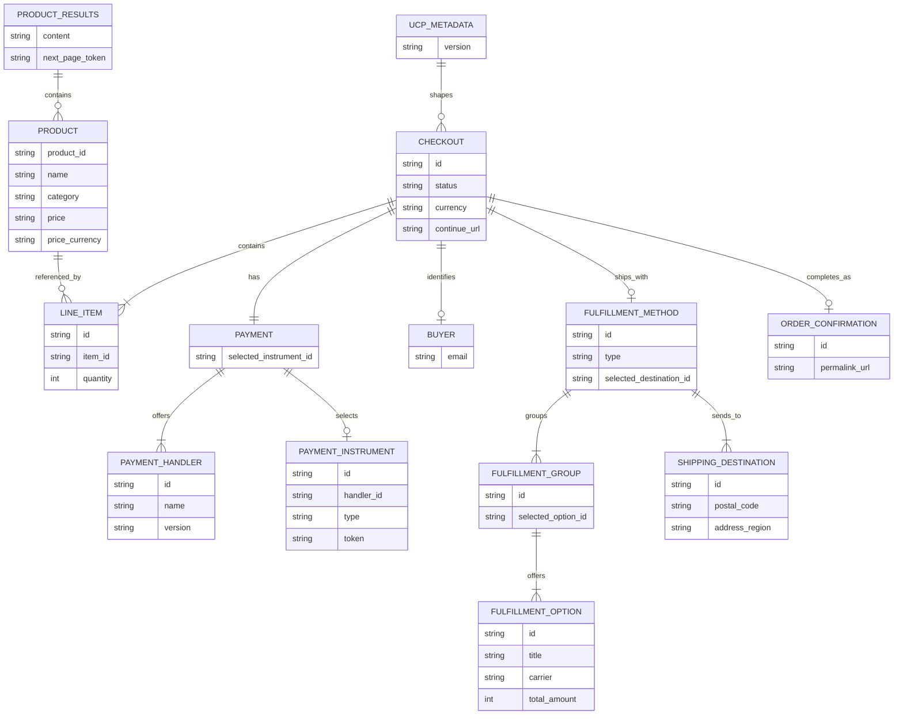

# ER図

この ER 図は、`samples/01-sample-a2a/` における商品検索結果、checkout、配送、支払い、注文確定の概念関係を表している。実体の多くは `business_agent/store.py` が組み立てる UCP SDK の応答オブジェクトに基づいている。

## 補足

- `CHECKOUT` は固定クラスではなく、`helpers/type_generator.py` が UCP capability に応じて `CheckoutResponse` / `FulfillmentCheckout` / `DiscountCheckout` / `BuyerConsentCheckout` を合成して生成する概念モデルである。
- `PAYMENT_HANDLER` は merchant 側 `data/ucp.json` から初期化され、`PAYMENT_INSTRUMENT` はフロントエンドの `CredentialProviderProxy` が生成して `complete_checkout` に渡す。
- `FULFILLMENT_*` 系の要素は fulfillment capability が有効なときに `store.add_delivery_address()` で組み立てられる。
- 実データストアは存在せず、`PRODUCT`、`CHECKOUT`、`ORDER_CONFIRMATION` はすべて `RetailStore` のインメモリ辞書で管理される。
