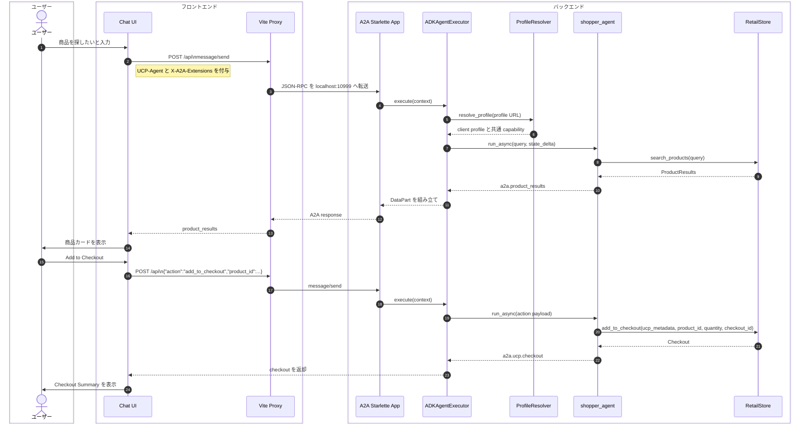
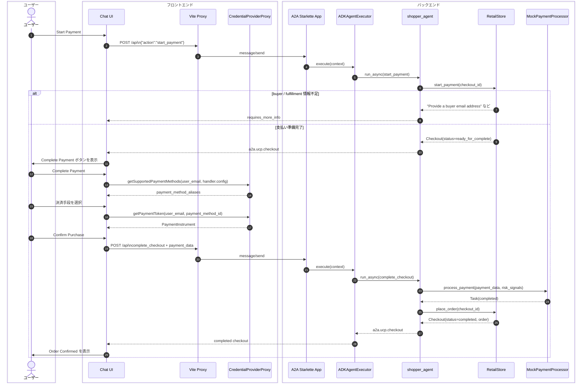
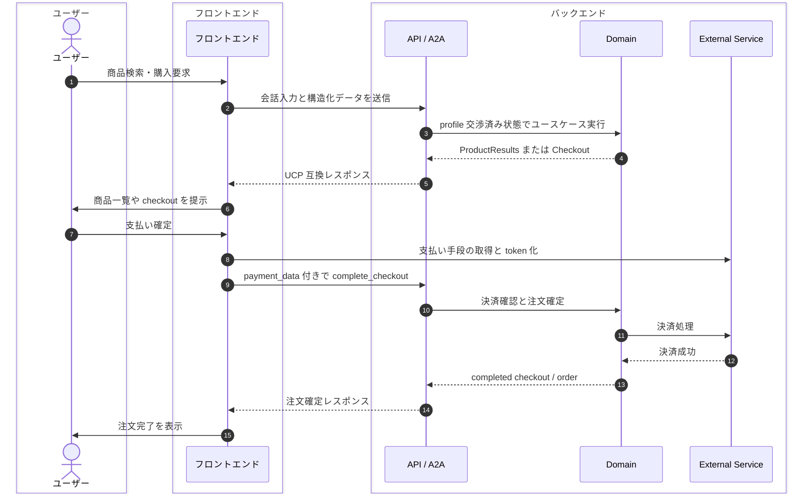

# シーケンス図

`samples/01-sample-a2a/` では、フロントエンドが A2A JSON-RPC を送信し、バックエンドが UCP profile を解決したうえで ADK エージェントを実行する。ここではアーキテクチャ理解に重要な 2 つの具体フローと、役割ベースに抽象化した流れを示す。

## システムレベル

### 商品検索から checkout 追加まで

### 支払い開始から注文確定まで

## 抽象化した流れ

