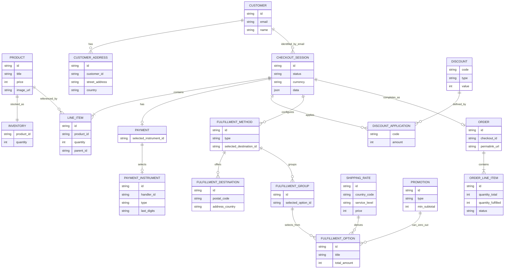

# ER図

この ER 図は、`samples/02-sample-restapi` の主要なドメイン関係を表す。SQLite に保存されるモデルと、UCP checkout / order レスポンスに現れる概念エンティティを合わせて整理している。

## 補足

- `CHECKOUT_SESSION.data` と `ORDER.data` は UCP SDK のレスポンス全体を JSON として保存しており、図ではその中の主要構造だけを抜き出している
- `PAYMENT`、`FULFILLMENT_METHOD`、`FULFILLMENT_GROUP`、`FULFILLMENT_OPTION`、`ORDER_LINE_ITEM` は主に UCP SDK の型とレスポンス JSON から読み取れる概念エンティティで、独立テーブルではない
- `FULFILLMENT_OPTION` は `ShippingRate` と `Promotion` をもとに `FulfillmentService` が都度組み立てる
- `PAYMENT_INSTRUMENT` は `payment_instruments.csv` 由来のテーブル定義を持つが、完了 API ではリクエストボディ中の instrument も直接処理する
