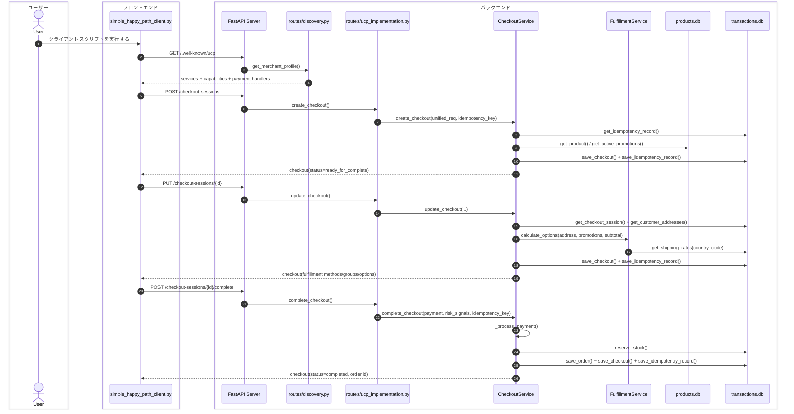
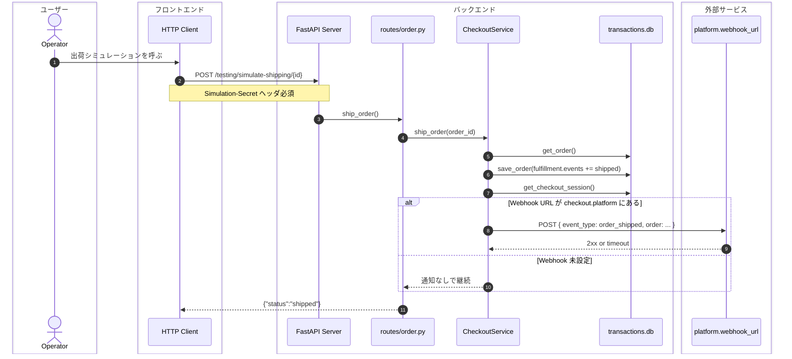
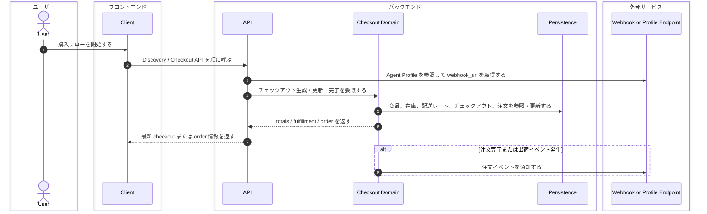

# シーケンス図

## システムレベル: Discovery から Checkout 完了まで

```mermaid
sequenceDiagram
    autonumber
    box ユーザー
        actor User
    end
    box フロントエンド
        participant Client as simple_happy_path_client.py
    end
    box バックエンド
        participant API as FastAPI Server
        participant Discovery as routes/discovery.py
        participant Impl as routes/ucp_implementation.py
        participant Checkout as CheckoutService
        participant Fulfillment as FulfillmentService
        participant PDB as products.db
        participant TDB as transactions.db
    end

    User->>Client: クライアントスクリプトを実行する
    Client->>API: GET /.well-known/ucp
    API->>Discovery: get_merchant_profile()
    Discovery-->>Client: services + capabilities + payment handlers

    Client->>API: POST /checkout-sessions
    API->>Impl: create_checkout()
    Impl->>Checkout: create_checkout(unified_req, idempotency_key)
    Checkout->>TDB: get_idempotency_record()
    Checkout->>PDB: get_product() / get_active_promotions()
    Checkout->>TDB: save_checkout() + save_idempotency_record()
    Checkout-->>Client: checkout(status=ready_for_complete)

    Client->>API: PUT /checkout-sessions/{id}
    API->>Impl: update_checkout()
    Impl->>Checkout: update_checkout(...)
    Checkout->>TDB: get_checkout_session() + get_customer_addresses()
    Checkout->>Fulfillment: calculate_options(address, promotions, subtotal)
    Fulfillment->>TDB: get_shipping_rates(country_code)
    Checkout->>TDB: save_checkout() + save_idempotency_record()
    Checkout-->>Client: checkout(fulfillment methods/groups/options)

    Client->>API: POST /checkout-sessions/{id}/complete
    API->>Impl: complete_checkout()
    Impl->>Checkout: complete_checkout(payment, risk_signals, idempotency_key)
    Checkout->>Checkout: _process_payment()
    Checkout->>TDB: reserve_stock()
    Checkout->>TDB: save_order() + save_checkout() + save_idempotency_record()
    Checkout-->>Client: checkout(status=completed, order.id)
```

## システムレベル: 出荷シミュレーションと Webhook 通知

```mermaid
sequenceDiagram
    autonumber
    box ユーザー
        actor Operator
    end
    box フロントエンド
        participant Caller as HTTP Client
    end
    box バックエンド
        participant API as FastAPI Server
        participant OrderRoute as routes/order.py
        participant Checkout as CheckoutService
        participant TDB as transactions.db
    end
    box 外部サービス
        participant Webhook as platform.webhook_url
    end

    Operator->>Caller: 出荷シミュレーションを呼ぶ
    Caller->>API: POST /testing/simulate-shipping/{id}
    Note over Caller,API: Simulation-Secret ヘッダ必須
    API->>OrderRoute: ship_order()
    OrderRoute->>Checkout: ship_order(order_id)
    Checkout->>TDB: get_order()
    Checkout->>TDB: save_order(fulfillment.events += shipped)
    Checkout->>TDB: get_checkout_session()
    alt Webhook URL が checkout.platform にある
        Checkout->>Webhook: POST { event_type: order_shipped, order: ... }
        Webhook-->>Checkout: 2xx or timeout
    else Webhook 未設定
        Checkout-->>OrderRoute: 通知なしで継続
    end
    OrderRoute-->>Caller: {"status":"shipped"}
```

## 抽象化したシーケンス

```mermaid
sequenceDiagram
    autonumber
    box ユーザー
        actor User
    end
    box フロントエンド
        participant UI as Client
    end
    box バックエンド
        participant API
        participant Domain as Checkout Domain
        participant Store as Persistence
    end
    box 外部サービス
        participant External as Webhook or Profile Endpoint
    end

    User->>UI: 購入フローを開始する
    UI->>API: Discovery / Checkout API を順に呼ぶ
    API->>External: Agent Profile を参照して webhook_url を取得する
    API->>Domain: チェックアウト生成・更新・完了を委譲する
    Domain->>Store: 商品、在庫、配送レート、チェックアウト、注文を参照・更新する
    Domain-->>API: totals / fulfillment / order を返す
    API-->>UI: 最新 checkout または order 情報を返す
    alt 注文完了または出荷イベント発生
        Domain->>External: 注文イベントを通知する
    end
```
